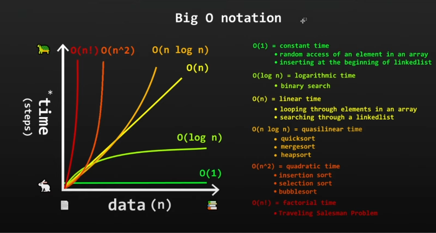
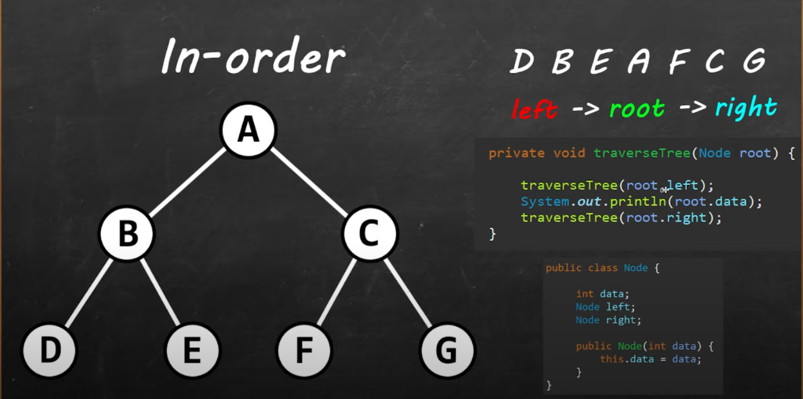
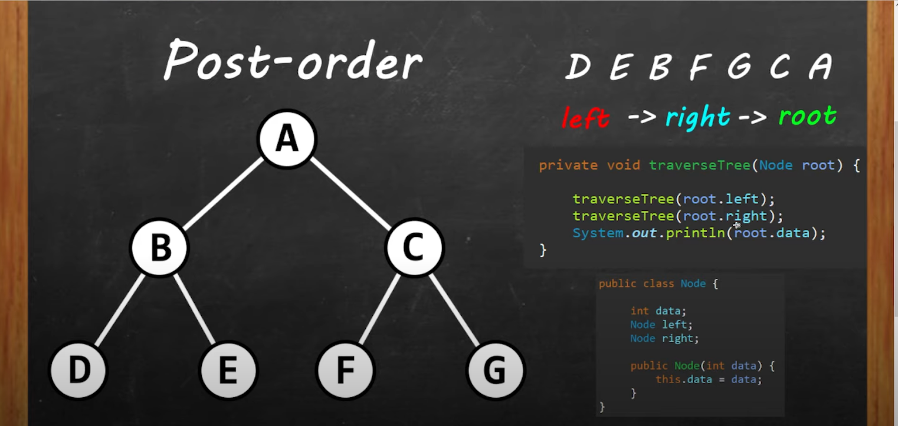
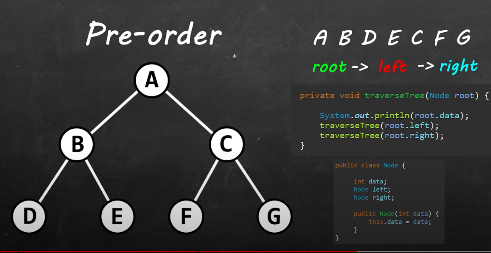


---[DATA STRUCTURES ALGORITHMS]---
---
# 1. STACKS

In computer science, a **stack** is a linear data structure that follows the Last-In, First-Out (LIFO) principle, meaning the last element added is the first to be removed. Stacks are often visualized as a vertical tower, where you can only add or remove elements from the top.

```java
import java.util.Stack;

public class Main {
    public static void main(String[] args) {

        // stack = LIFO data structure. Last-In First-Out
        //         stores objects into a sort of "vertical tower"
        //         push() to add to the top
        //         pop() to remove from the top

        // Creating a stack
        Stack<String> stack = new Stack<>();

        // Pushing games onto the stack
        stack.push("CS:GO");
        stack.push("Fortnite");
        stack.push("Doom");
        stack.push("Minecraft");

        // Printing the stack
        System.out.println("Games in the stack: " + stack);

        // Search for a game
        String gameToSearch = "Doom";
        int position = stack.search(gameToSearch);
        if (position != -1) {
            System.out.println(gameToSearch + " found at position " + position);
        } else {
            System.out.println(gameToSearch + " not found in the stack.");
        }

        // Popping games from the stack
        String poppedGame = stack.pop();
        System.out.println("Popped game: " + poppedGame);
        System.out.println("Games after popping: " + stack);

        // Peeking the top game without removing it
        String topGame = stack.peek();
        System.out.println("Top game: " + topGame);

        // Checking if the stack is empty
        System.out.println("Is stack empty? " + stack.isEmpty());

        // Size of the stack
        System.out.println("Size of the stack: " + stack.size());
    }
}
```

Explanation
- **Creating a Stack:** A stack is created using the `Stack` class from the Java Collections Framework.
- **Pushing Elements:** The `push()` method adds elements to the top of the stack.
- **Searching for Elements:** The `search()` method returns the position of an element from the top of the stack, or `-1` if not found.
- **Popping Elements:** The `pop()` method removes and returns the top element from the stack.
- **Peeking the Top Element:** The `peek()` method returns the top element without removing it.
- **Checking if Empty:** The `isEmpty()` method checks whether the stack is empty.
- **Getting Size:** The `size()` method returns the number of elements in the stack.
---

# 2. QUEUES

In computer science, a **queue** is a linear data structure that follows the First-In, First-Out (FIFO) principle. This means that the first element added to the queue will be the first one to be removed. Queues are often visualized as a line of elements where new elements are added to the back and removed from the front.

```java
import java.util.LinkedList;
import java.util.Queue;

public class Main {
    public static void main(String[] args) {
        // Creating a queue
        Queue<String> queue = new LinkedList<>();

        // Adding elements to the queue
        queue.add("Apple");
        queue.add("Banana");
        queue.add("Orange");
        queue.add("Mango");

        // Printing the queue
        System.out.println("Queue: " + queue);

        // Removing elements from the queue using poll()
        String polledElement = queue.poll();
        System.out.println("Polled element: " + polledElement);
        System.out.println("Queue after poll: " + queue);

        // Removing elements from the queue using remove()
        String removedElement = queue.remove();
        System.out.println("Removed element: " + removedElement);
        System.out.println("Queue after removal: " + queue);

        // Retrieving but not removing the head of the queue
        String peekedElement = queue.peek();
        System.out.println("Peeked element: " + peekedElement);
        System.out.println("Queue after peek: " + queue);

        // Checking if the queue is empty
        System.out.println("Is queue empty? " + queue.isEmpty());

        // Size of the queue
        System.out.println("Size of the queue: " + queue.size());
    }
}
```

Explanation
- **Creating a Queue:** A queue is created using the `Queue` interface, implemented here by the `LinkedList` class.
- **Adding Elements:** The `add()` method appends elements to the back of the queue.
- **Polling Elements:** The `poll()` method retrieves and removes the head of the queue, returning `null` if the queue is empty.
- **Removing Elements:** The `remove()` method also retrieves and removes the head of the queue, but it throws an exception if the queue is empty.
- **Peeking the Head Element:** The `peek()` method retrieves the head of the queue without removing it, returning `null` if the queue is empty.
- **Checking if Empty:** The `isEmpty()` method checks whether the queue is empty.
- **Getting Size:** The `size()` method returns the number of elements in the queue.
---

# 3. PRIORITY QUEUES

A **priority queue** is a specialized data structure that operates similarly to a regular queue but with a key difference: each element has a priority associated with it. In a priority queue, elements with higher priorities are served before elements with lower priorities. If two elements have the same priority, they are served according to their order in the queue (FIFO).

```java
import java.util.*;

public class Main {

    public static void main(String args[]) {
        // Priority Queue = A FIFO data structure that serves elements
        //                  with the highest priorities first
        //                  before elements with lower priority

        Queue<String> queue = new PriorityQueue<>(Collections.reverseOrder());

        queue.offer("B");
        queue.offer("A");
        queue.offer("C");
        queue.offer("Z");
        queue.offer("X");

        while (!queue.isEmpty()) {
            System.out.println(queue.poll());
        }
    }
}
```

- **Creating a Priority Queue:** A priority queue is created using the `PriorityQueue` class. In this example, `Collections.reverseOrder()` is used to sort the elements in descending order, so higher alphabetic characters are given higher priority.
- **Adding Elements:** The `offer()` method adds elements to the priority queue.
- **Polling Elements:** The `poll()` method retrieves and removes the head of the queue, which is the element with the highest priority. If the queue is empty, it returns `null`.
- **Iterating Through the Queue:** A while loop is used to print elements as they are removed from the queue, demonstrating that elements are served in priority order.

---
# 4. LINKED LISTS

A **linked list** is a linear data structure consisting of nodes, where each node contains data and a reference (or pointer) to the next node in the sequence. This structure allows for efficient insertion and deletion of elements.

When to Use Linked Lists
- **Small Data Set:** Linked lists are generally not ideal, as the overhead of pointers can be detrimental.
- **Large Data Set with Lots of Searching:** Still not ideal due to O(n) search time.
- **Large Data Set with Lots of Inserting/Deleting:** Linked lists excel in this scenario, as they allow O(1) insertion and deletion.

Advantages
1. **Dynamic Data Structure:** Allocates memory as needed while running, making it flexible.
2. **Easy Insertion and Deletion of Nodes:** Operations can be done in O(1) time.
3. **No/Low Memory Waste:** Allocates exactly the required memory.

Disadvantages
1. **Greater Memory Usage:** Each node requires additional memory for pointers.
2. **No Random Access of Elements:** Elements cannot be accessed via an index; they must be traversed sequentially.
3. **Time-Consuming Accessing/Searching:** Searching for elements takes O(n) time.

Common Uses
- Implementing stacks and queues.
- GPS navigation systems.
- Music playlists.

```java
import java.util.LinkedList;

public class Main {
    public static void main(String[] args) {
        // *****************************************************

        // LinkedList =  Nodes are in 2 parts (data + address)
        //                Nodes are in non-consecutive memory locations
        //                Elements are linked using pointers

        // *****************************************************

        LinkedList<String> linkedList = new LinkedList<String>();

        // LinkedList as a Queue
        linkedList.offer("A");
        linkedList.offer("B");
        linkedList.offer("C");
        linkedList.offer("D");
        linkedList.offer("F");

        // Print the contents of the linked list
        System.out.println(linkedList);
    }
}
```

Explanation
- **Creating a Linked List:** A `LinkedList` is created using the `LinkedList` class.
- **Adding Elements:** The `offer()` method is used to add elements to the linked list.
- **Output:** The contents of the linked list are printed to the console.
---
# 5. DYNAMIC ARRAYS

A **dynamic array** is an array that can grow or shrink in size as needed, allowing for flexible data management. Unlike standard arrays, which have a fixed size, dynamic arrays automatically adjust their capacity to accommodate new elements.

Key Features
- **Automatic Resizing:** When the array reaches its capacity, it automatically increases its size, allowing for more elements to be added.
- **Efficient Operations:** Provides efficient element access (O(1)) and average-case insertion/deletion (O(1) amortized).

```java
public class Main {
    public static void main(String[] args) {
        DynamicArray dynamicArray = new DynamicArray(5);

        dynamicArray.add("A");
        dynamicArray.add("B");
        dynamicArray.add("C");

        // Uncomment to use additional functionalities
        // System.out.println(dynamicArray.get(0));
        // dynamicArray.insert(0, "X");
        // dynamicArray.delete("A");
        // System.out.println(dynamicArray.search("C"));

        System.out.println(dynamicArray);
        System.out.println("Size: " + dynamicArray.size);
        System.out.println("Capacity: " + dynamicArray.capacity);
        System.out.println("Is empty: " + dynamicArray.isEmpty());
    }
}

class DynamicArray {
    int size;
    int capacity = 10;
    Object[] array;

    public DynamicArray() {
        this.array = new Object[capacity];
    }

    public DynamicArray(int capacity) {
        this.capacity = capacity;
        this.array = new Object[capacity];
    }

    public Object get(int index) {
        return array[index];
    }

    public void add(Object data) {
        if (size >= capacity) {
            grow();
        }
        array[size] = data;
        size++;
    }

    public void insert(int index, Object data) {
        if (size >= capacity) {
            grow();
        }
        for (int i = size; i > index; i--) {
            array[i] = array[i - 1];
        }
        array[index] = data;
        size++;
    }

    public void delete(Object data) {
        for (int i = 0; i < size; i++) {
            if (array[i] == data) {
                for (int j = 0; j < (size - i - 1); j++) {
                    array[i + j] = array[i + j + 1];
                }
                array[size - 1] = null;
                size--;
                if (size <= (int) (capacity / 3)) {
                    shrink();
                }
                break;
            }
        }
    }

    public int search(Object data) {
        for (int i = 0; i < size; i++) {
            if (array[i] == data) {
                return i;
            }
        }
        return -1;
    }

    private void grow() {
        int newCapacity = (int) (capacity * 2);
        Object[] newArray = new Object[newCapacity];

        for (int i = 0; i < size; i++) {
            newArray[i] = array[i];
        }
        capacity = newCapacity;
        array = newArray;
    }

    private void shrink() {
        int newCapacity = (int) (capacity / 2);
        Object[] newArray = new Object[newCapacity];

        for (int i = 0; i < size; i++) {
            newArray[i] = array[i];
        }
        capacity = newCapacity;
        array = newArray;
    }

    public boolean isEmpty() {
        return size == 0;
    }

    public String toString() {
        StringBuilder stringBuilder = new StringBuilder();
        stringBuilder.append("[");
        for (int i = 0; i < size; i++) {
            stringBuilder.append(array[i]).append(", ");
        }
        if (size > 0) {
            stringBuilder.setLength(stringBuilder.length() - 2); // Remove last comma and space
        }
        stringBuilder.append("]");
        return stringBuilder.toString();
    }

    public void clear() {
        size = 0;
        capacity = 10;
        array = new Object[capacity];
    }
}
```

Explanation
- **Dynamic Array Initialization:** The `DynamicArray` class initializes an internal array with a specified capacity.
- **Adding Elements:** The `add()` method appends elements to the array, growing the array if necessary.
- **Inserting Elements:** The `insert()` method allows inserting elements at specific indices, shifting existing elements as needed.
- **Deleting Elements:** The `delete()` method removes elements and shrinks the array if it's one-third full.
- **Searching Elements:** The `search()` method finds the index of a given element.
- **Dynamic Resizing:** The `grow()` and `shrink()` methods adjust the array size, ensuring efficient memory usage.
--- 
# 7. BIG O NOTATION




--- 
# 8. LINEAR SEARCH

```java
public class Main {

    public static void main(String[] args) {

        // Linear search = Iterate through a collection one element at a time

        // Initialize an array with elements
        int[] array = {9, 1, 8, 2, 7, 3, 6, 4, 5};

        // Perform linear search for the value 5 in the array
        int index = linearSearch(array, 5);

        // Check if the value was found and print the result
        if (index != -1) {
            System.out.println("Element found at index: " + index);
        } else {
            System.out.println("Element not found");
        }

    }

    // Method to perform linear search
    private static int linearSearch(int[] array, int value) {
        // Iterate through the entire array
        for (int i = 0; i < array.length; i++) {
            // Check if the current element matches the value
            if (array[i] == value) {
                // Return the index if a match is found
                return i;
            }
        }
        // Return -1 if the value is not found
        return -1;
    }
}
```

Explanation:

1. **Linear Search Concept**:
   - Linear search is a simple searching algorithm that checks each element in a collection (like an array) one at a time until it finds the target value or reaches the end of the collection.

2. **Main Method**:
   - The `main` method is the entry point of the program.
   - An integer array named `array` is initialized with some values.
   - The `linearSearch` method is called with the array and the value `5` to search for.

3. **Search Result**:
   - The index returned by the `linearSearch` method is stored in the variable `index`.
   - An if-else statement checks if `index` is not equal to `-1` (indicating the value was found). It prints the index if found; otherwise, it indicates that the value was not found.

4. **Linear Search Method**:
   - The `linearSearch` method takes an array and a value to search for as parameters.
   - A `for` loop iterates through each element of the array.
   - Inside the loop, an if condition checks if the current element (`array[i]`) matches the value being searched for.
   - If a match is found, the method returns the index of that element.
   - If the loop completes without finding the value, the method returns `-1` to indicate that the value is not present in the array. 

Time Complexity:
- The time complexity of linear search is **O(n)**, where **n** is the number of elements in the array. This means in the worst case, the algorithm may need to check every element in the array.
---
# 9. BINARY SEARCH

**Search algorithm that finds the position of a target value within a sorted array. Half of the array is eliminated during each "step".**

```java
import java.util.Arrays;

public class Main {

    public static void main(String[] args) {

        // Initialize a large sorted array of integers from 0 to 999999
        int array[] = new int[1000000];
        int target = 777777; // The target value to search for

        // Populate the array with values from 0 to 999999
        for (int i = 0; i < array.length; i++) {
            array[i] = i;
        }

        // Perform binary search to find the target value
        int index = binarySearch(array, target);

        // Check if the value was found and print the result
        if (index == -1) {
            System.out.println(target + " not found");
        } else {
            System.out.println("Element found at: " + index);
        }
    }

    // Method to perform binary search
    private static int binarySearch(int[] array, int target) {

        int low = 0; // Starting index of the search range
        int high = array.length - 1; // Ending index of the search range

        // Continue searching while the low index is less than or equal to the high index
        while (low <= high) {

            // Calculate the middle index
            int middle = low + (high - low) / 2;
            int value = array[middle]; // Value at the middle index

            // Print the middle value for debugging
            System.out.println("middle: " + value);

            // Compare the middle value with the target
            if (value < target) {
                low = middle + 1; // Target is in the right half
            } else if (value > target) {
                high = middle - 1; // Target is in the left half
            } else {
                return middle; // Target found at middle index
            }
        }

        return -1; // Target not found
    }
}
```

Explanation:

1. **Binary Search Concept**:
   - The binary search algorithm operates on a sorted array and efficiently finds the position of a target value by halving the search space with each comparison.
   - It is much faster than linear search for large datasets because it discards half of the remaining elements after each comparison.

2. **Main Method**:
   - In the `main` method, an array of size 1,000,000 is created and populated with integers from `0` to `999,999`.
   - A target value of `777777` is specified to be searched within the array.
   - The `binarySearch` method is called to find the index of the target.

3. **Search Result**:
   - After executing the binary search, the code checks if the index returned is `-1`, which indicates that the target was not found. If found, it prints the index where the target is located.

4. **Binary Search Method**:
   - The `binarySearch` method accepts an array and a target value.
   - It initializes two variables, `low` and `high`, to represent the current search range.
   - A `while` loop runs as long as `low` is less than or equal to `high`:
     - The `middle` index is calculated to find the midpoint of the current search range.
     - The value at the `middle` index is compared to the target value:
       - If the middle value is less than the target, the search continues in the upper half by adjusting `low`.
       - If the middle value is greater than the target, the search continues in the lower half by adjusting `high`.
       - If a match is found, the index of the target is returned.
   - If the loop ends without finding the target, the method returns `-1`.

Time Complexity:
- The time complexity of binary search is **O(log n)**, where **n** is the number of elements in the array. This logarithmic efficiency is what makes binary search particularly suitable for large sorted datasets.
---

# 10. INTERPOLATION SEARCH

**Improvement over binary search best used for "uniformly" distributed data. "Guesses" where a value might be based on calculated probe results. If the probe is incorrect, the search area is narrowed, and a new probe is calculated.**

- **Average case time complexity**: **O(log(log(n)))**
- **Worst case time complexity**: **O(n)** (when values increase exponentially)

```java
public class Main {

    public static void main(String[] args) {

        // An array of uniformly distributed integers
        int[] array = {1, 2, 3, 4, 5, 6, 7, 8, 9};

        // Perform interpolation search for the value 8
        int index = interpolationSearch(array, 8);

        // Check if the value was found and print the result
        if (index != -1) {
            System.out.println("Element found at index: " + index);
        } else {
            System.out.println("Element not found");
        }
    }

    // Method to perform interpolation search
    private static int interpolationSearch(int[] array, int value) {

        int low = 0; // Starting index of the search range
        int high = array.length - 1; // Ending index of the search range

        // Continue searching while value is within the range of the array
        while (value >= array[low] && value <= array[high] && low <= high) {

            // Calculate the probe position based on the formula
            int probe = low + (high - low) * (value - array[low]) /
                    (array[high] - array[low]);

            // Check if the probe value matches the target
            if (array[probe] == value) {
                return probe; // Target found
            } else if (array[probe] < value) {
                low = probe + 1; // Narrow search to the upper half
            } else {
                high = probe - 1; // Narrow search to the lower half
            }
        }

        return -1; // Target not found
    }
}
```

Explanation:

1. **Interpolation Search Concept**:
   - Interpolation search is an improvement over binary search that works better for uniformly distributed data.
   - Instead of dividing the search range in half, it calculates the likely position of the target value based on its value relative to the values at the endpoints of the current search range.
   - If the probe (the estimated position of the target) is incorrect, the search area is narrowed, and a new probe is calculated.

2. **Main Method**:
   - The `main` method initializes an array of uniformly distributed integers from `1` to `9`.
   - It calls the `interpolationSearch` method to find the index of the target value `8`.

3. **Search Result**:
   - After executing the search, it checks the returned index. If it’s `-1`, the target is not found; otherwise, it prints the index of the found target.

4. **Interpolation Search Method**:
   - The `interpolationSearch` method takes an array and a target value as parameters.
   - It initializes two variables, `low` and `high`, representing the current search range.
   - A `while` loop continues as long as the target value is within the range defined by `low` and `high`.
     - It calculates the `probe` index based on the formula:
       \[
       \text{probe} = \text{low} + \frac{(\text{high} - \text{low}) \times (\text{value} - \text{array[low]})}{(\text{array[high]} - \text{array[low]})}
       \]
     - The formula estimates the position of the target value in the array based on the values at the `low` and `high` indices.
     - The value at the `probe` index is compared to the target:
       - If it matches, the method returns the `probe` index.
       - If the `probe` value is less than the target, the search continues in the upper half by adjusting `low`.
       - If the `probe` value is greater than the target, the search continues in the lower half by adjusting `high`.
   - If the loop ends without finding the target, the method returns `-1`.

Time Complexity:
- The average time complexity of interpolation search is **O(log(log(n)))**, making it very efficient for large datasets with uniformly distributed values. However, in the worst case, particularly when values are not uniformly distributed, the complexity can degrade to **O(n)**.
--- 
# 11. BUBBLE SORT

**Bubble sort: pairs of adjacent elements are compared, and the elements are swapped if they are not in order.**

- **Time Complexity**: Quadratic time **O(n²)**
- **Performance**:
  - Small dataset: **Okay-ish**
  - Large dataset: **BAD** (please don't use)

```java
public class Main {

    public static void main(String[] args) {

        // An array of unsorted integers
        int array[] = {9, 1, 8, 2, 7, 3, 6, 4, 5};

        // Perform bubble sort on the array
        bubbleSort(array);

        // Print the sorted array
        for (int i : array) {
            System.out.print(i + " "); // Print each element followed by a space
        }
    }

    // Method to perform bubble sort
    public static void bubbleSort(int array[]) {

        // Outer loop for the number of passes
        for (int i = 0; i < array.length - 1; i++) {
            // Inner loop for comparing adjacent elements
            for (int j = 0; j < array.length - i - 1; j++) {
                // If the current element is greater than the next, swap them
                if (array[j] > array[j + 1]) {
                    // Swap using a temporary variable
                    int temp = array[j];
                    array[j] = array[j + 1];
                    array[j + 1] = temp;
                }
            }
        }
    }
}
```

Explanation:

1. **Bubble Sort Concept**:
   - Bubble sort is a simple sorting algorithm that repeatedly steps through the list, compares adjacent elements, and swaps them if they are in the wrong order.
   - The process is repeated until the list is sorted.
   - Named "bubble" sort because smaller elements "bubble" to the top of the array.

2. **Main Method**:
   - The `main` method initializes an array of unsorted integers.
   - It calls the `bubbleSort` method to sort the array.
   - After sorting, it prints the sorted array elements.

3. **Bubble Sort Method**:
   - The `bubbleSort` method takes an array of integers as a parameter.
   - It uses two nested loops:
     - The outer loop runs from `0` to `array.length - 1`, representing the number of passes through the array.
     - The inner loop runs from `0` to `array.length - i - 1`, comparing adjacent elements.
   - During each pass, adjacent elements are compared:
     - If the current element `array[j]` is greater than the next element `array[j + 1]`, they are swapped using a temporary variable.
   - The inner loop ensures that after each complete pass, the largest unsorted element moves to its correct position at the end of the array.

Time Complexity:
- The average and worst-case time complexity of bubble sort is **O(n²)**, where **n** is the number of elements in the array. This makes bubble sort inefficient on large datasets compared to more advanced sorting algorithms like quicksort or mergesort. It is generally suitable only for small datasets. 
---

# 12. SELECTION SORT

**Selection sort: search through an array and keep track of the minimum value during each iteration. At the end of each iteration, we swap values.**

- **Time Complexity**: Quadratic time **O(n²)**
- **Performance**:
  - Small dataset: **Okay**
  - Large dataset: **BAD**

```java
public class Main {

    public static void main(String[] args) {

        // An array of unsorted integers
        int array[] = {8, 7, 9, 2, 3, 1, 5, 4, 6};

        // Perform selection sort on the array
        selectionSort(array);

        // Print the sorted array
        for (int i : array) {
            System.out.print(i + " "); // Print each element followed by a space
        }
    }

    // Method to perform selection sort
    private static void selectionSort(int[] array) {

        // Outer loop for the number of iterations
        for (int i = 0; i < array.length - 1; i++) {
            int min = i; // Assume the minimum is the first element in the unsorted part
            // Inner loop for finding the minimum element in the unsorted part
            for (int j = i + 1; j < array.length; j++) {
                if (array[min] > array[j]) {
                    min = j; // Update the index of the minimum element
                }
            }

            // Swap the found minimum element with the first element of the unsorted part
            int temp = array[i];
            array[i] = array[min];
            array[min] = temp;
        }
    }
}
```

Explanation:

1. **Selection Sort Concept**:
   - Selection sort is a simple comparison-based sorting algorithm.
   - It divides the input array into two parts: a sorted part and an unsorted part.
   - It repeatedly selects the smallest (or largest, depending on the sorting order) element from the unsorted part and moves it to the end of the sorted part.

2. **Main Method**:
   - The `main` method initializes an array of unsorted integers.
   - It calls the `selectionSort` method to sort the array.
   - After sorting, it prints the sorted array elements.

3. **Selection Sort Method**:
   - The `selectionSort` method takes an array of integers as a parameter.
   - It uses two nested loops:
     - The outer loop runs from `0` to `array.length - 1`, representing the number of passes through the array.
     - The inner loop runs from `i + 1` to `array.length`, searching for the minimum element in the unsorted portion of the array.
   - During each iteration of the outer loop:
     - It initializes `min` to the current index `i`.
     - The inner loop checks each subsequent element in the array to find the smallest element.
     - If a smaller element is found, it updates the `min` index.
   - After finding the minimum element, it swaps it with the first element of the unsorted part (the current position `i`).

Time Complexity:
- The average and worst-case time complexity of selection sort is **O(n²)**, where **n** is the number of elements in the array. This makes selection sort inefficient on large datasets compared to more advanced sorting algorithms like quicksort or mergesort. It is generally suitable only for small datasets.
--- 
# 13. INSERTION SORT

**Insertion sort: after comparing elements to the left, shift elements to the right to make room to insert a value.**

- **Time Complexity**: Quadratic time **O(n²)**
- **Performance**:
  - Small dataset: **Decent**
  - Large dataset: **BAD**

- **Comparison with Other Sorts**:
  - Less steps than Bubble sort.
  - Best case is **O(n)** compared to Selection sort **O(n²)**.

```java
public class Main {

    public static void main(String[] args) {

        // An array of unsorted integers
        int array[] = {9, 1, 8, 2, 7, 3, 6, 5, 4};

        // Perform insertion sort on the array
        insertionSort(array);

        // Print the sorted array
        for (int i : array) {
            System.out.print(i + " "); // Print each element followed by a space
        }
    }

    // Method to perform insertion sort
    private static void insertionSort(int[] array) {

        // Start from the second element as a sorted part
        for (int i = 1; i < array.length; i++) {
            int temp = array[i]; // Current element to be inserted
            int j = i - 1; // Last index of the sorted part

            // Shift elements of the sorted part to the right
            while (j >= 0 && array[j] > temp) {
                array[j + 1] = array[j]; // Shift the element to the right
                j--; // Move to the previous element
            }
            array[j + 1] = temp; // Insert the current element at the right position
        }
    }
}
```

Explanation:

1. **Insertion Sort Concept**:
   - Insertion sort builds a sorted array (or list) one element at a time.
   - It takes each element from the unsorted part and finds the appropriate position in the sorted part by comparing it to the elements on its left.
   - It then shifts elements to the right to create space for the new element.

2. **Main Method**:
   - The `main` method initializes an array of unsorted integers.
   - It calls the `insertionSort` method to sort the array.
   - After sorting, it prints the sorted array elements.

3. **Insertion Sort Method**:
   - The `insertionSort` method takes an array of integers as a parameter.
   - It uses a single loop starting from the second element (index 1) since a single element (index 0) is trivially sorted.
   - Within the loop:
     - The current element to be inserted is stored in `temp`.
     - A variable `j` is initialized to point to the last index of the sorted part.
   - The inner `while` loop shifts elements in the sorted part to the right until it finds the correct position for `temp`:
     - If `array[j]` is greater than `temp`, it shifts `array[j]` to `array[j + 1]`.
     - This continues until the correct position is found or the beginning of the array is reached.
   - Finally, `temp` is placed in its correct position in the sorted part.

Time Complexity:
- The average and worst-case time complexity of insertion sort is **O(n²)**, where **n** is the number of elements in the array. However, it performs well on small or partially sorted datasets, making it a reasonable choice for smaller lists. The best case occurs when the array is already sorted, resulting in a time complexity of **O(n)**.
---
# 14. RECURSION

**Recursion**: When a thing is defined in terms of itself. It applies the result of a procedure to a procedure. A recursive method calls itself and can be a substitute for iteration. It divides a problem into sub-problems of the same type as the original. Commonly used with advanced sorting algorithms and navigating trees.

Advantages:
- Easier to read/write.
- Easier to debug.

Disadvantages:
- Sometimes slower.
- Uses more memory.

```java
public class Main {

    public static void main(String[] args) {

        // Demonstrates the usage of recursive methods
        walk(5); // Initiates the walk method with 5 steps
        System.out.println(factorial(7)); // Computes and prints the factorial of 7
        System.out.println(power(2, 8)); // Computes and prints 2 raised to the power of 8
    }

    // Recursive method to simulate walking
    private static void walk(int steps) {
        if (steps < 1) return; // Base case: stop when there are no steps left
        System.out.println("You take a step!"); // Print the step message
        walk(steps - 1); // Recursive case: walk one less step
    }

    // Recursive method to calculate the factorial of a number
    private static int factorial(int num) {
        if (num < 1) return 1; // Base case: factorial of 0! is 1
        return num * factorial(num - 1); // Recursive case: num * factorial of (num - 1)
    }

    // Recursive method to calculate the power of a number
    private static int power(int base, int power) {
        if (power < 1) return 1; // Base case: any number raised to the power of 0 is 1
        return base * power(base, power - 1); // Recursive case: base * power of (base, power - 1)
    }
}
```

Explanation:

1. **Main Method**:
   - The `main` method serves as the entry point of the program.
   - It demonstrates the usage of recursive methods by calling:
     - `walk(5)`: Simulates walking 5 steps.
     - `factorial(7)`: Computes the factorial of 7 and prints it.
     - `power(2, 8)`: Computes \(2^8\) (2 raised to the power of 8) and prints it.

2. **Walk Method**:
   - The `walk` method is a recursive method that simulates taking steps.
   - **Base Case**: If `steps` is less than 1, the method returns (stopping condition).
   - **Recursive Case**: It prints "You take a step!" and calls itself with `steps - 1`, effectively reducing the number of steps until the base case is met.

3. **Factorial Method**:
   - The `factorial` method computes the factorial of a given number recursively.
   - **Base Case**: If `num` is less than 1, it returns 1 (since \(0! = 1\)).
   - **Recursive Case**: It returns `num * factorial(num - 1)`, multiplying the current number by the factorial of the previous number.

4. **Power Method**:
   - The `power` method calculates the power of a base number recursively.
   - **Base Case**: If `power` is less than 1, it returns 1 (since any number raised to the power of 0 is 1).
   - **Recursive Case**: It returns `base * power(base, power - 1)`, multiplying the base by the result of raising the base to the previous power.

Summary:
- Recursion is a powerful technique that simplifies complex problems by breaking them down into smaller sub-problems.
- It can lead to elegant and easily understandable code but may be less efficient in terms of memory and performance compared to iterative approaches, especially for large inputs.
Here’s your Java code for **Merge Sort** along with detailed explanations:

# 15. MERGE SORT

**Merge Sort**: A divide-and-conquer algorithm that recursively divides an array into two halves, sorts them, and then combines (merges) them back together. 

Complexity:
- **Run-time complexity**: \( O(n \log n) \)
- **Space complexity**: \( O(n) \)

```java
public class Main {

    public static void main(String args[]) {
        // Sample array to be sorted
        int[] array = {8, 2, 5, 3, 4, 7, 6, 1};

        // Performing merge sort on the array
        mergeSort(array);

        // Printing the sorted array
        for (int i = 0; i < array.length; i++) {
            System.out.print(array[i] + " ");
        }
    }

    // Merge sort function
    private static void mergeSort(int[] array) {
        int length = array.length;
        if (length <= 1) return; // Base case: array is already sorted

        // Finding the middle index
        int middle = length / 2;
        
        // Creating left and right sub-arrays
        int[] leftArray = new int[middle];
        int[] rightArray = new int[length - middle];

        // Splitting the original array into left and right
        for (int i = 0; i < length; i++) {
            if (i < middle) {
                leftArray[i] = array[i]; // Fill left array
            } else {
                rightArray[i - middle] = array[i]; // Fill right array
            }
        }

        // Recursively sorting the left and right sub-arrays
        mergeSort(leftArray);
        mergeSort(rightArray);

        // Merging the sorted sub-arrays back into the original array
        merge(leftArray, rightArray, array);
    }

    // Function to merge two sorted arrays
    private static void merge(int[] leftArray, int[] rightArray, int[] array) {
        int leftSize = leftArray.length; // Size of left sub-array
        int rightSize = rightArray.length; // Size of right sub-array
        int i = 0, l = 0, r = 0; // Indices for the main array, left array, and right array

        // Merging elements from left and right arrays into the main array
        while (l < leftSize && r < rightSize) {
            if (leftArray[l] < rightArray[r]) {
                array[i] = leftArray[l]; // Add smaller element to the main array
                i++;
                l++;
            } else {
                array[i] = rightArray[r]; // Add smaller element to the main array
                i++;
                r++;
            }
        }

        // Adding remaining elements from left array (if any)
        while (l < leftSize) {
            array[i] = leftArray[l];
            i++;
            l++;
        }

        // Adding remaining elements from right array (if any)
        while (r < rightSize) {
            array[i] = rightArray[r];
            i++;
            r++;
        }
    }
}
```

Explanation:

1. **Main Method**:
   - The `main` method initializes a sample array and calls `mergeSort` to sort it.
   - After sorting, it prints the sorted array to the console.

2. **Merge Sort Method**:
   - The `mergeSort` method divides the array into two halves until the base case is met (when the length of the array is less than or equal to 1).
   - It calculates the `middle` index to split the array.
   - Two new arrays (`leftArray` and `rightArray`) are created to hold the left and right halves of the original array.
   - A loop iterates through the original array to populate the left and right arrays.
   - After splitting, the method recursively calls itself on the left and right arrays to sort them.
   - Finally, it calls the `merge` method to combine the sorted sub-arrays back into the original array.

3. **Merge Method**:
   - The `merge` method combines two sorted arrays (`leftArray` and `rightArray`) into a single sorted array.
   - It initializes indices for the main array, left array, and right array.
   - A while loop compares the elements from both arrays and places the smaller element into the main array.
   - After one of the arrays is completely merged, any remaining elements from the other array are added to the main array.

Summary:
- **Merge Sort** is an efficient sorting algorithm that performs well on large datasets with a guaranteed time complexity of \( O(n \log n) \).
- Its main advantage is that it is stable (does not change the relative order of elements with equal keys) and can be applied to linked lists and external sorting.
- However, it requires additional space proportional to the size of the array, which may not be ideal for memory-constrained environments.
---
# 16. QUICK SORT

**Quick Sort**: A highly efficient sorting algorithm that follows the divide-and-conquer strategy. It partitions the array into smaller sub-arrays based on a pivot element, recursively sorting them.

Complexity:
- **Run-time complexity**: 
  - Best case: \( O(n \log n) \)
  - Average case: \( O(n \log n) \)
  - Worst case: \( O(n^2) \) (occurs when the array is already sorted)
- **Space complexity**: \( O(\log n) \) due to recursion stack.

```java
public class Main {

    public static void main(String args[]) {
        // Sample array to be sorted
        int[] array = {8, 2, 5, 3, 9, 4, 7, 6, 1};

        // Performing quick sort on the array
        quickSort(array, 0, array.length - 1);

        // Printing the sorted array
        for (int i : array) {
            System.out.print(i + " ");
        }
    }

    // Quick sort function
    private static void quickSort(int[] array, int start, int end) {
        if (end <= start) return; // Base case: when the array is already sorted

        // Partition the array and get the pivot index
        int pivot = partition(array, start, end);
        
        // Recursively sort elements before and after partition
        quickSort(array, start, pivot - 1);
        quickSort(array, pivot + 1, end);
    }

    // Function to partition the array
    private static int partition(int[] array, int start, int end) {
        int pivot = array[end]; // Choosing the last element as pivot
        int i = start - 1; // Pointer for the smaller element

        // Loop through the array to rearrange elements
        for (int j = start; j < end; j++) {
            if (array[j] < pivot) { // If current element is smaller than pivot
                i++; // Increment index of smaller element
                // Swap array[i] and array[j]
                int temp = array[i];
                array[i] = array[j];
                array[j] = temp;
            }
        }
        // Swap the pivot element with the element at i + 1
        i++;
        int temp = array[i];
        array[i] = array[end];
        array[end] = temp;

        return i; // Return the partition index
    }
}
```

Explanation:

1. **Main Method**:
   - The `main` method initializes a sample array and calls the `quickSort` method to sort it.
   - After sorting, it prints the sorted array to the console.

2. **Quick Sort Method**:
   - The `quickSort` method takes three parameters: the array, the starting index (`start`), and the ending index (`end`).
   - It checks if the `end` index is less than or equal to the `start` index (base case), indicating that the array (or sub-array) is already sorted.
   - The `partition` method is called to rearrange the elements around a pivot element, which divides the array into two parts.
   - The method then recursively calls itself for the left (`start` to `pivot - 1`) and right (`pivot + 1` to `end`) partitions.

3. **Partition Method**:
   - The `partition` method selects the last element of the array as the pivot.
   - It initializes a pointer (`i`) to track the position of the smaller element.
   - A loop iterates through the array (excluding the pivot), comparing each element with the pivot.
   - If an element is smaller than the pivot, it swaps it with the element at index `i`, and increments `i`.
   - After processing all elements, it swaps the pivot with the element at index `i + 1`, ensuring the pivot is in its correct position.
   - Finally, it returns the index of the pivot, which is used to partition the array for the next recursive calls.

Summary:
- **Quick Sort** is a very efficient sorting algorithm, especially for large datasets, with an average time complexity of \( O(n \log n) \).
- The worst-case scenario (which can be avoided with better pivot selection techniques) occurs with already sorted data, leading to \( O(n^2) \) time complexity.
- Quick Sort is an in-place sorting algorithm, requiring minimal additional memory, making it suitable for systems with limited space. 
---
# 17. HASH TABLES

**Hash Tables**: A data structure that stores key-value pairs, allowing for efficient insertion, lookup, and deletion of entries based on unique keys.

Key Concepts:
- **Hashtable**: Stores unique keys and associated values. Each key-value pair is called an *Entry*.
- **Hashing**: A technique that takes a key and computes an index using a hash function.
  - The index is calculated using the formula:
    \[
    \text{index} = \text{key.hashCode()} \mod \text{capacity}
    \]
- **Bucket**: An indexed storage location that can hold one or more Entries. This structure is often implemented using a linked list to handle collisions.
- **Collision**: Occurs when different keys produce the same index. Fewer collisions lead to higher efficiency.
- **Complexity**:
  - Best Case: \( O(1) \) (when there are no collisions)
  - Worst Case: \( O(n) \) (when all keys hash to the same index)

```java
import java.util.*;

public class Main {

    public static void main(String args[]) {
        // Creating a hashtable with an initial capacity of 10
        Hashtable<Integer, String> table = new Hashtable<>(10);

        // Adding key-value pairs to the hashtable
        table.put(100, "Spongebob");
        table.put(123, "Patrick");
        table.put(321, "Sandy");
        table.put(555, "Squidward");
        table.put(777, "Gary");

        // Iterating through the keys of the hashtable
        for (Integer key : table.keySet()) {
            // Printing the hash index, key, and associated value
            System.out.println(key.hashCode() % 10 + "\t" + key + "\t" + table.get(key));
        }
    }
}
```

Explanation:

1. **Import Statement**:
   - The `import java.util.*;` statement imports the `Hashtable` class and other utility classes from the `java.util` package.

2. **Main Method**:
   - The `main` method is the entry point of the program.

3. **Creating a Hashtable**:
   - `Hashtable<Integer, String> table = new Hashtable<>(10);` creates a new hashtable with an initial capacity of 10.
   - The keys are of type `Integer`, and the values are of type `String`.

4. **Adding Entries**:
   - The `put` method is used to add key-value pairs to the hashtable. For example, `table.put(100, "Spongebob");` adds a new entry with the key `100` and the value `"Spongebob"`.

5. **Iterating through Keys**:
   - The `for` loop iterates through the keys in the hashtable using `table.keySet()`, which returns a set of the keys.
   - For each key, it calculates the index using `key.hashCode() % 10` and prints:
     - The index
     - The key
     - The corresponding value retrieved using `table.get(key)`.

Summary:
- **Hash Tables** provide fast access to data based on unique keys, making them ideal for large datasets.
- They use a hash function to compute an index, allowing for efficient data retrieval.
- The handling of collisions through linked lists helps maintain performance, although a poor hash function can degrade efficiency.
- The overall performance is highly dependent on the quality of the hash function and the load factor of the hashtable.
---
# 18. GRAPHS

**Graphs**: A data structure used to represent a collection of nodes (or vertices) and the connections (or edges) between them. Graphs can be directed or undirected and can be used to model various real-world problems.

Key Concepts:
- **Vertices**: The individual elements or nodes of the graph.
- **Edges**: The connections between vertices, representing relationships.
- **Adjacency List**: A way to represent a graph where each vertex has a list of adjacent vertices.

```java
import java.util.*;

class Grafas {
    private int viršūniųSkaičius; // Number of vertices
    private LinkedList<Integer> sąsajosSąrašas[]; // Adjacency list representation

    // Constructor
    Grafas(int v) {
        viršūniųSkaičius = v;
        sąsajosSąrašas = new LinkedList[v];
        for (int i = 0; i < v; ++i)
            sąsajosSąrašas[i] = new LinkedList();
    }

    // Function to add an edge to the graph
    void pridėtiBriauną(int v, int w) {
        sąsajosSąrašas[v].add(w);
    }

    // Function to print the graph's adjacency list representation
    void spausdintiGrafą() {
        for (int i = 0; i < viršūniųSkaičius; ++i) {
            System.out.print("Vertex " + i + " is connected to: ");
            if (!sąsajosSąrašas[i].isEmpty()) {
                for (int j = 0; j < sąsajosSąrašas[i].size(); j++) {
                    System.out.print(sąsajosSąrašas[i].get(j));
                    if (j != sąsajosSąrašas[i].size() - 1)
                        System.out.print(", ");
                }
            } else {
                System.out.print("none");
            }
            System.out.println();
        }
    }
}

public class Main {
    public static void main(String args[]) {
        // Create a graph with 5 vertices
        Grafas grafas = new Grafas(5);

        // Add edges
        grafas.pridėtiBriauną(0, 1);
        grafas.pridėtiBriauną(0, 4);
        grafas.pridėtiBriauną(1, 2);
        grafas.pridėtiBriauną(1, 3);
        grafas.pridėtiBriauną(1, 4);
        grafas.pridėtiBriauną(2, 3);
        grafas.pridėtiBriauną(3, 4);

        // Print the graph
        grafas.spausdintiGrafą();
    }
}
```

Explanation:

1. **Imports**:
   - The `import java.util.*;` statement imports the necessary classes from the Java Collections Framework.

2. **Grafas Class**:
   - The `Grafas` class represents the graph.

   - **Attributes**:
     - `viršūniųSkaičius`: An integer representing the number of vertices in the graph.
     - `sąsajosSąrašas`: An array of `LinkedList<Integer>`, representing the adjacency list for each vertex.

   - **Constructor**:
     - `Grafas(int v)`: Initializes the number of vertices and creates an adjacency list for each vertex.

   - **Methods**:
     - `pridėtiBriauną(int v, int w)`: Adds an edge from vertex `v` to vertex `w` by appending `w` to the adjacency list of `v`.
     - `spausdintiGrafą()`: Prints the adjacency list representation of the graph. It iterates through each vertex and displays its connected vertices. If a vertex has no connections, it prints "none".

3. **Main Class**:
   - The `Main` class contains the `main` method, which serves as the program entry point.

   - **Creating a Graph**:
     - A new graph with 5 vertices is created using `Grafas grafas = new Grafas(5);`.

   - **Adding Edges**:
     - Various edges are added to the graph using the `pridėtiBriauną` method.

   - **Printing the Graph**:
     - Finally, the `spausdintiGrafą` method is called to print the graph's adjacency list representation.

Summary:
- **Graphs** are powerful data structures that can model complex relationships and connections.
- The adjacency list representation used in this code is space-efficient and well-suited for sparse graphs.
- This implementation supports directed graphs, where the direction of the edges matters (e.g., from vertex `v` to vertex `w`). For undirected graphs, you would also need to add edges in the opposite direction (i.e., from `w` to `v`).
---
# 19. ADJACENCY MATRIX

**Adjacency Matrix**: A 2D array representation of a graph where rows and columns represent the nodes. Each element in the matrix indicates whether an edge exists between the nodes.

Key Concepts:
- **Nodes**: The elements of the graph.
- **Edges**: Connections between the nodes, represented as `1` (edge exists) or `0` (no edge).
- **Space Complexity**: \(O(v^2)\) where \(v\) is the number of vertices.
- **Time Complexity**: Checking for an edge is \(O(1)\).

**Main Class**

```java
public class Main {
    public static void main(String[] args) {
        // Adjacency Matrix = An array to store 1's/0's to represent edges
        //				       # of rows =    # of unique nodes
        //				       # of columns = # of unique nodes

        //					  runtime complexity to check an Edge: O(1)
        //					  space complexity: O(v^2)

        Graph graph = new Graph(5);

        graph.addNode(new Node('A'));
        graph.addNode(new Node('B'));
        graph.addNode(new Node('C'));
        graph.addNode(new Node('D'));
        graph.addNode(new Node('E'));

        graph.addEdge(0, 1);
        graph.addEdge(1, 2);
        graph.addEdge(1, 4);
        graph.addEdge(2, 3);
        graph.addEdge(2, 4);
        graph.addEdge(4, 0);
        graph.addEdge(4, 2);

        graph.print();

        //System.out.println(graph.checkEdge(0, 1));
    }
}
```

**Graph Class**

```java
import java.util.ArrayList;

public class Graph {
    ArrayList<Node> nodes;
    int[][] matrix;

    Graph(int size) {
        nodes = new ArrayList<>();
        matrix = new int[size][size];
    }

    public void addNode(Node node) {
        nodes.add(node);
    }

    public void addEdge(int src, int dst) {
        matrix[src][dst] = 1; // Set the matrix value to 1 to indicate an edge from src to dst
    }

    public boolean checkEdge(int src, int dst) {
        return matrix[src][dst] == 1; // Returns true if there's an edge
    }

    public void print() {
        // Print the header
        System.out.print("  ");
        for (Node node : nodes) {
            System.out.print(node.data + " ");
        }
        System.out.println();

        // Print the adjacency matrix
        for (int i = 0; i < matrix.length; i++) {
            System.out.print(nodes.get(i).data + " ");
            for (int j = 0; j < matrix[i].length; j++) {
                System.out.print(matrix[i][j] + " ");
            }
            System.out.println();
        }
    }
}
```

**Node Class**

```java
public class Node {
    char data;

    Node(char data) {
        this.data = data; // Store the node's data
    }
}
```

1. **Imports**:
   - `import java.util.ArrayList;` imports the ArrayList class to store nodes.

2. **Main Class**:
   - The `Main` class contains the `main` method, where the program starts execution.

   - **Graph Creation**:
     - An instance of `Graph` is created with space for 5 nodes.

   - **Adding Nodes**:
     - Nodes labeled 'A', 'B', 'C', 'D', and 'E' are added to the graph using `addNode()`.

   - **Adding Edges**:
     - Edges are added to represent connections between nodes using `addEdge()`, where the first parameter is the source node index, and the second is the destination node index.

   - **Printing the Graph**:
     - The `print()` method is called to display the adjacency matrix representation of the graph.

3. **Graph Class**:
   - The `Graph` class manages the nodes and the adjacency matrix.

   - **Attributes**:
     - `ArrayList<Node> nodes`: Stores the graph's nodes.
     - `int[][] matrix`: A 2D array (adjacency matrix) where `matrix[i][j]` is `1` if there is an edge from node `i` to node `j`, otherwise `0`.

   - **Constructor**:
     - `Graph(int size)`: Initializes the `nodes` list and the `matrix` of size `size x size`.

   - **Methods**:
     - `addNode(Node node)`: Adds a node to the `nodes` list.
     - `addEdge(int src, int dst)`: Sets the matrix value at `src` and `dst` to `1`, indicating an edge.
     - `checkEdge(int src, int dst)`: Returns `true` if there is an edge from `src` to `dst`.
     - `print()`: Displays the nodes and their connections as an adjacency matrix.

4. **Node Class**:
   - The `Node` class represents a graph node.
   - **Attribute**:
     - `char data`: Stores the data of the node (e.g., 'A', 'B', etc.).
   - **Constructor**:
     - `Node(char data)`: Initializes the `data` attribute with the given value.

Summary:
- The adjacency matrix is a simple and efficient way to represent dense graphs, allowing for constant-time edge checks.
- The space complexity grows quadratically with the number of nodes, which can be a drawback for sparse graphs.
- This implementation allows for easy addition of nodes and edges, as well as efficient checks for the existence of edges between nodes.
---
# 20. ADJACENCY LIST

**Adjacency List**: A more space-efficient way to represent a graph, especially when it's sparse. Each node has a list of its neighbors, allowing for efficient edge representation.

Key Concepts:
- **Nodes**: The elements of the graph.
- **Edges**: Connections between the nodes, stored in linked lists.
- **Space Complexity**: \(O(v + e)\) where \(v\) is the number of vertices and \(e\) is the number of edges.
- **Time Complexity**: Checking for an edge is \(O(v)\) in the worst case.

**Main Class**

```java
public class Main {
    public static void main(String[] args) {
        // Adjacency List = An array/arraylist of linked lists.
        //			          Each LinkedList has a unique node at the head.
        //			          All adjacent neighbors to that node are added to that node's linked list

        //				  runtime complexity to check an Edge: O(v)
        //				  space complexity: O(v + e)

        Graph graph = new Graph();

        graph.addNode(new Node('A'));
        graph.addNode(new Node('B'));
        graph.addNode(new Node('C'));
        graph.addNode(new Node('D'));
        graph.addNode(new Node('E'));

        graph.addEdge(0, 1);
        graph.addEdge(1, 2);
        graph.addEdge(1, 4);
        graph.addEdge(2, 3);
        graph.addEdge(2, 4);
        graph.addEdge(4, 0);
        graph.addEdge(4, 2);

        graph.print();

        //System.out.println(graph.checkEdge(0, 1));
    }
}
```

**Graph Class**

```java
import java.util.*;

public class Graph {
    ArrayList<LinkedList<Node>> alist;

    Graph() {
        alist = new ArrayList<>();
    }

    public void addNode(Node node) {
        LinkedList<Node> currentList = new LinkedList<>();
        currentList.add(node);
        alist.add(currentList); // Create a new linked list for the node
    }

    public void addEdge(int src, int dst) {
        LinkedList<Node> currentList = alist.get(src); // Get the linked list for the source node
        Node dstNode = alist.get(dst).get(0); // Get the destination node
        currentList.add(dstNode); // Add the destination node to the source's list
    }

    public boolean checkEdge(int src, int dst) {
        LinkedList<Node> currentList = alist.get(src); // Get the linked list for the source node
        Node dstNode = alist.get(dst).get(0); // Get the destination node

        // Check if the destination node is in the source's list
        for (Node node : currentList) {
            if (node == dstNode) {
                return true; // Edge exists
            }
        }
        return false; // Edge does not exist
    }

    public void print() {
        for (LinkedList<Node> currentList : alist) {
            for (Node node : currentList) {
                System.out.print(node.data + " -> "); // Print the current node
            }
            System.out.println(); // Move to the next line for the next node
        }
    }
}
```

**Node Class**

```java
public class Node {
    char data;

    Node(char data) {
        this.data = data; // Store the node's data
    }
}
```

**Explanation:**

1. **Imports**:
   - `import java.util.*;` imports the necessary classes from the Java utility package, including `ArrayList` and `LinkedList`.

2. **Main Class**:
   - The `Main` class contains the `main` method, which is the entry point of the program.

   - **Graph Creation**:
     - An instance of `Graph` is created, which will store the nodes and their connections.

   - **Adding Nodes**:
     - Nodes labeled 'A', 'B', 'C', 'D', and 'E' are added to the graph using `addNode()`.

   - **Adding Edges**:
     - Edges are established using `addEdge()`, connecting the specified source and destination nodes by index.

   - **Printing the Graph**:
     - The `print()` method is called to display the adjacency list representation of the graph.

3. **Graph Class**:
   - The `Graph` class manages the nodes and their connections using an adjacency list.

   - **Attributes**:
     - `ArrayList<LinkedList<Node>> alist`: A list of linked lists where each list contains the adjacent nodes for a particular node.

   - **Constructor**:
     - `Graph()`: Initializes the adjacency list.

   - **Methods**:
     - `addNode(Node node)`: Creates a new linked list for each node and adds it to the adjacency list.
     - `addEdge(int src, int dst)`: Adds the destination node to the source node's linked list, establishing an edge.
     - `checkEdge(int src, int dst)`: Checks if there is an edge from the source to the destination by looking through the source's linked list.
     - `print()`: Displays the adjacency list for each node.

4. **Node Class**:
   - The `Node` class represents a node in the graph.
   - **Attribute**:
     - `char data`: Holds the data of the node (e.g., 'A', 'B', etc.).
   - **Constructor**:
     - `Node(char data)`: Initializes the `data` attribute with the given value.

**Summary:**
- The adjacency list is a more flexible and space-efficient way to represent graphs, particularly when the graph is sparse (i.e., has fewer edges).
- The space complexity is linear relative to the number of nodes and edges, making it more efficient than the adjacency matrix for large, sparse graphs.
- This implementation allows for easy addition of nodes and edges, as well as efficient checks for the existence of edges between nodes.
---
# 21. DEPTH FIRST SEARCH

**Depth First Search (DFS)**: A graph traversal algorithm that explores as far as possible along each branch before backtracking. It uses a stack (either implicitly via recursion or explicitly) to remember the path taken.

**Key Concepts:**
- **Traversal Strategy**: Pick a route and keep going until a dead end or an already visited node is reached, then backtrack.
- **Space Complexity**: \(O(v)\) for the stack space where \(v\) is the number of vertices.
- **Time Complexity**: \(O(v + e)\) where \(e\) is the number of edges.

**Main Class**

```java
public class Main {
    public static void main(String[] args) {
        // Depth First Search = Pick a route, keep going.
        //					 If you reach a dead end, or an already visited node,
        //					 backtrack to a previous node with unvisited adjacent neighbors

        Graph graph = new Graph(5);

        graph.addNode(new Node('A'));
        graph.addNode(new Node('B'));
        graph.addNode(new Node('C'));
        graph.addNode(new Node('D'));
        graph.addNode(new Node('E'));

        graph.addEdge(0, 1);
        graph.addEdge(1, 2);
        graph.addEdge(1, 4);
        graph.addEdge(2, 3);
        graph.addEdge(2, 4);
        graph.addEdge(4, 0);
        graph.addEdge(4, 2);

        graph.print();

        graph.depthFirstSearch(0);
    }
}
```

**Graph Class**

```java
import java.util.*;

public class Graph {
    ArrayList<Node> nodes;
    int[][] matrix;

    Graph(int size) {
        nodes = new ArrayList<>();
        matrix = new int[size][size]; // Initialize the adjacency matrix
    }

    public void addNode(Node node) {
        nodes.add(node); // Add a node to the graph
    }

    public void addEdge(int src, int dst) {
        matrix[src][dst] = 1; // Set edge from src to dst in the adjacency matrix
    }

    public boolean checkEdge(int src, int dst) {
        return matrix[src][dst] == 1; // Check if there is an edge
    }

    public void print() {
        // Print header
        System.out.print("  ");
        for (Node node : nodes) {
            System.out.print(node.data + " ");
        }
        System.out.println();

        // Print adjacency matrix
        for (int i = 0; i < matrix.length; i++) {
            System.out.print(nodes.get(i).data + " ");
            for (int j = 0; j < matrix[i].length; j++) {
                System.out.print(matrix[i][j] + " ");
            }
            System.out.println();
        }
        System.out.println();
    }

    public void depthFirstSearch(int src) {
        boolean[] visited = new boolean[matrix.length]; // Array to keep track of visited nodes
        dFSHelper(src, visited); // Start DFS from the source node
    }

    private void dFSHelper(int src, boolean[] visited) {
        if (visited[src]) {
            return; // If already visited, backtrack
        } else {
            visited[src] = true; // Mark the node as visited
            System.out.println(nodes.get(src).data + " = visited");
        }

        // Recur for all adjacent nodes
        for (int i = 0; i < matrix[src].length; i++) {
            if (matrix[src][i] == 1) {
                dFSHelper(i, visited);
            }
        }
    }
}
```

**Node Class**

```java
public class Node {
    char data;

    Node(char data) {
        this.data = data; // Store the node's data
    }
}
```

**Explanation:**

1. **Imports**:
   - `import java.util.*;` imports the necessary classes from the Java utility package.

2. **Main Class**:
   - The `Main` class contains the `main` method, the entry point of the program.

   - **Graph Creation**:
     - An instance of `Graph` is created with a specified size of 5, accommodating 5 nodes.

   - **Adding Nodes**:
     - Nodes labeled 'A', 'B', 'C', 'D', and 'E' are added to the graph using `addNode()`.

   - **Adding Edges**:
     - Edges are established using `addEdge()`, connecting the specified source and destination nodes by index.

   - **Printing the Graph**:
     - The `print()` method is called to display the adjacency matrix representation of the graph.

   - **Depth First Search**:
     - The `depthFirstSearch()` method is called with `0` as the starting index, initiating the DFS traversal from node 'A'.

3. **Graph Class**:
   - The `Graph` class manages nodes and their connections using an adjacency matrix.

   - **Attributes**:
     - `ArrayList<Node> nodes`: A list to hold the graph's nodes.
     - `int[][] matrix`: An adjacency matrix representing the connections between nodes.

   - **Constructor**:
     - `Graph(int size)`: Initializes the list of nodes and the adjacency matrix of the given size.

   - **Methods**:
     - `addNode(Node node)`: Adds a new node to the graph.
     - `addEdge(int src, int dst)`: Establishes an edge between the source and destination nodes by updating the adjacency matrix.
     - `checkEdge(int src, int dst)`: Checks if there is an edge between the specified nodes.
     - `print()`: Displays the adjacency matrix of the graph.
     - `depthFirstSearch(int src)`: Initiates the DFS traversal from the specified source node, using a boolean array to track visited nodes.
     - `dFSHelper(int src, boolean[] visited)`: Recursively visits nodes in depth-first order. If a node has already been visited, it backtracks. Otherwise, it marks the node as visited and explores all adjacent nodes.

4. **Node Class**:
   - The `Node` class represents a node in the graph.
   - **Attribute**:
     - `char data`: Holds the data of the node (e.g., 'A', 'B', etc.).
   - **Constructor**:
     - `Node(char data)`: Initializes the `data` attribute with the given value.

**Summary:**
- **Depth First Search (DFS)** is a fundamental graph traversal technique, useful for various applications, including pathfinding and cycle detection.
- The implementation uses an adjacency matrix for storing edges, allowing for efficient checks and traversals.
- DFS explores as far down a branch as possible before backtracking, ensuring all nodes reachable from the starting point are visited.
---
# 22. BREADTH FIRST SEARCH

**Breadth First Search (BFS)**: A graph traversal algorithm that explores all the neighboring nodes at the present depth before moving on to nodes at the next depth level. It uses a queue to manage the order of exploration.

**Key Concepts:**
- **Traversal Strategy**: Traverse a graph level by level.
- **Data Structure**: Utilizes a queue for maintaining the order of nodes to be explored.
- **Performance**: More efficient for finding the shortest path in unweighted graphs or when the destination is typically close to the start node.

**Main Class**

```java
public class Main {
    public static void main(String[] args) {
        // Breadth FS = Traverse a graph level by level
        //			   Utilizes a Queue
        //			   Better if destination is on average close to start
        //			   Siblings are visited before children

        // Depth FS   = Traverse a graph branch by branch
        //			   Utilizes a Stack
        //			   Better if destination is on average far from the start
        //			   Children are visited before siblings
        //			   More popular for games/puzzles

        Graph graph = new Graph(5);

        graph.addNode(new Node('A'));
        graph.addNode(new Node('B'));
        graph.addNode(new Node('C'));
        graph.addNode(new Node('D'));
        graph.addNode(new Node('E'));

        graph.addEdge(0, 1);
        graph.addEdge(1, 2);
        graph.addEdge(1, 4);
        graph.addEdge(2, 3);
        graph.addEdge(2, 4);
        graph.addEdge(4, 0);
        graph.addEdge(4, 2);

        graph.print();

        graph.breadthFirstSearch(0);
    }
}
```

**Graph Class**

```java
import java.util.*;

public class Graph {
    ArrayList<Node> nodes;
    int[][] matrix;

    Graph(int size) {
        nodes = new ArrayList<>();
        matrix = new int[size][size]; // Initialize the adjacency matrix
    }

    public void addNode(Node node) {
        nodes.add(node); // Add a node to the graph
    }

    public void addEdge(int src, int dst) {
        matrix[src][dst] = 1; // Set edge from src to dst in the adjacency matrix
    }

    public boolean checkEdge(int src, int dst) {
        return matrix[src][dst] == 1; // Check if there is an edge
    }

    public void print() {
        // Print header
        System.out.print("  ");
        for (Node node : nodes) {
            System.out.print(node.data + " ");
        }
        System.out.println();

        // Print adjacency matrix
        for (int i = 0; i < matrix.length; i++) {
            System.out.print(nodes.get(i).data + " ");
            for (int j = 0; j < matrix[i].length; j++) {
                System.out.print(matrix[i][j] + " ");
            }
            System.out.println();
        }
        System.out.println();
    }

    public void breadthFirstSearch(int src) {
        Queue<Integer> queue = new LinkedList<>(); // Initialize the queue
        boolean[] visited = new boolean[matrix.length]; // Track visited nodes

        queue.offer(src); // Start from the source node
        visited[src] = true; // Mark the source as visited

        while (queue.size() != 0) {
            src = queue.poll(); // Remove and get the head of the queue
            System.out.println(nodes.get(src).data + " = visited"); // Visit the node

            // Explore all adjacent nodes
            for (int i = 0; i < matrix[src].length; i++) {
                if (matrix[src][i] == 1 && !visited[i]) {
                    queue.offer(i); // Add unvisited adjacent node to the queue
                    visited[i] = true; // Mark it as visited
                }
            }
        }
    }
}
```

**Node Class**

```java
public class Node {
    char data;

    Node(char data) {
        this.data = data; // Store the node's data
    }
}
```

**Explanation:**

1. **Imports**:
   - `import java.util.*;` imports the necessary classes from the Java utility package, including `Queue` and `LinkedList`.

2. **Main Class**:
   - The `Main` class contains the `main` method, the entry point of the program.

   - **Graph Creation**:
     - An instance of `Graph` is created with a specified size of 5, allowing for the addition of 5 nodes.

   - **Adding Nodes**:
     - Nodes labeled 'A', 'B', 'C', 'D', and 'E' are added to the graph using `addNode()`.

   - **Adding Edges**:
     - Edges are established using `addEdge()`, connecting the specified source and destination nodes by index.

   - **Printing the Graph**:
     - The `print()` method is called to display the adjacency matrix representation of the graph.

   - **Breadth First Search**:
     - The `breadthFirstSearch()` method is called with `0` as the starting index, initiating the BFS traversal from node 'A'.

3. **Graph Class**:
   - The `Graph` class manages nodes and their connections using an adjacency matrix.

   - **Attributes**:
     - `ArrayList<Node> nodes`: A list to hold the graph's nodes.
     - `int[][] matrix`: An adjacency matrix representing the connections between nodes.

   - **Constructor**:
     - `Graph(int size)`: Initializes the list of nodes and the adjacency matrix of the given size.

   - **Methods**:
     - `addNode(Node node)`: Adds a new node to the graph.
     - `addEdge(int src, int dst)`: Establishes an edge between the source and destination nodes by updating the adjacency matrix.
     - `checkEdge(int src, int dst)`: Checks if there is an edge between the specified nodes.
     - `print()`: Displays the adjacency matrix of the graph.
     - `breadthFirstSearch(int src)`: Initiates the BFS traversal from the specified source node, using a queue and a boolean array to track visited nodes.

4. **Node Class**:
   - The `Node` class represents a node in the graph.
   - **Attribute**:
     - `char data`: Holds the data of the node (e.g., 'A', 'B', etc.).
   - **Constructor**:
     - `Node(char data)`: Initializes the `data` attribute with the given value.

**Summary:**
- **Breadth First Search (BFS)** is an essential graph traversal technique, effective for finding the shortest path in unweighted graphs.
- The implementation uses an adjacency matrix for storing edges, enabling efficient checks and traversals.
- BFS explores all neighbors at the present depth before moving to the next depth level, ensuring that siblings are visited before their children.
---
# 24. BINARY SEARCH TREE 🌳

**Main Class**

```java
public class Main {

    public static void main(String[] args) {
        // Binary Search Tree = A tree data structure, where each node is greater than its left child,
        //                      but less than its right.

        // Benefit: easy to locate a node when they are in this order
        // Time complexity: best case O(log n), worst case O(n)
        // Space complexity: O(n)

        BinarySearchTree tree = new BinarySearchTree();

        // Inserting nodes into the tree
        tree.insert(new Node(5));
        tree.insert(new Node(1));
        tree.insert(new Node(9));
        tree.insert(new Node(2));
        tree.insert(new Node(7));
        tree.insert(new Node(3));
        tree.insert(new Node(6));
        tree.insert(new Node(4));
        tree.insert(new Node(8));

        // Display the contents of the BST in sorted order
        tree.display();
    }
}
```

**Binary Search Tree Class**

```java
public class BinarySearchTree {

    Node root; // Root node of the BST

    // Insert a new node into the BST
    public void insert(Node node) {
        root = insertHelper(root, node);
    }

    // Helper method to insert a node recursively
    private Node insertHelper(Node root, Node node) {
        int data = node.data;

        // If the current root is null, place the new node here
        if (root == null) {
            root = node;
            return root;
        }
        // Recursively traverse the left or right subtree
        else if (data < root.data) {
            root.left = insertHelper(root.left, node);
        } else {
            root.right = insertHelper(root.right, node);
        }

        return root;
    }

    // Display the BST in sorted order (In-order traversal)
    public void display() {
        displayHelper(root);
    }

    // Helper method for in-order traversal
    private void displayHelper(Node root) {
        if (root != null) {
            displayHelper(root.left); // Visit left subtree
            System.out.println(root.data); // Visit root
            displayHelper(root.right); // Visit right subtree
        }
    }

    // Search for a specific value in the BST
    public boolean search(int data) {
        return searchHelper(root, data);
    }

    // Helper method for searching a value recursively
    private boolean searchHelper(Node root, int data) {
        if (root == null) {
            return false; // Base case: not found
        } else if (root.data == data) {
            return true; // Found the value
        } else if (root.data > data) {
            return searchHelper(root.left, data); // Search left subtree
        } else {
            return searchHelper(root.right, data); // Search right subtree
        }
    }

    // Remove a specific value from the BST
    public void remove(int data) {
        if (search(data)) {
            root = removeHelper(root, data);
        } else {
            System.out.println(data + " could not be found");
        }
    }

    // Helper method for removing a node recursively
    private Node removeHelper(Node root, int data) {
        if (root == null) {
            return root; // Base case: not found
        } else if (data < root.data) {
            root.left = removeHelper(root.left, data); // Traverse left
        } else if (data > root.data) {
            root.right = removeHelper(root.right, data); // Traverse right
        } else { // Node found
            // Case 1: No child
            if (root.left == null && root.right == null) {
                root = null;
            }
            // Case 2: One child (right)
            else if (root.right != null) {
                root.data = successor(root); // Find and replace with successor
                root.right = removeHelper(root.right, root.data);
            }
            // Case 3: One child (left)
            else {
                root.data = predecessor(root); // Find and replace with predecessor
                root.left = removeHelper(root.left, root.data);
            }
        }
        return root;
    }

    // Find the successor (smallest value in right subtree)
    private int successor(Node root) {
        root = root.right;
        while (root.left != null) {
            root = root.left;
        }
        return root.data;
    }

    // Find the predecessor (largest value in left subtree)
    private int predecessor(Node root) {
        root = root.left;
        while (root.right != null) {
            root = root.right;
        }
        return root.data;
    }
}
```

**Node Class**

```java
public class Node {

    int data; // Value of the node
    Node left; // Left child
    Node right; // Right child

    public Node(int data) {
        this.data = data; // Initialize node with data
    }
}
```

**Key Features of the Implementation**

- **Insertion**: New nodes are added based on their value, maintaining the BST property.
- **Display**: In-order traversal is used to display the nodes in sorted order.
- **Search**: A method to check for the presence of a value in the BST.
- **Removal**: Nodes can be removed, handling cases where the node has zero, one, or two children.
- **Successor and Predecessor**: Helper methods to find the next and previous nodes for removal operations.

**Complexity Analysis**

- **Time Complexity**: 
  - **Insertion/Search**: O(log n) on average, O(n) in the worst case (unbalanced tree).
- **Space Complexity**: O(n) for storing nodes.

This implementation showcases a typical Binary Search Tree and its key operations efficiently. If you have any questions or need further elaboration on any part, feel free to ask!

---
# 25. TREE TRAVERSAL





# 26. CALCULATE EXECUTION TIME ⏱️

**Main Class**

```java
public class Main {

    public static void main(String[] args) throws InterruptedException {

        // Start the timer
        long start = System.nanoTime();

        // -------- program --------

        // Simulate a delay of 3 seconds
        Thread.sleep(3000);

        // -------------------------------

        // Calculate the duration by subtracting the start time from the current time
        long duration = (System.nanoTime() - start) / 1000000; // Convert from nanoseconds to milliseconds

        // Print the duration
        System.out.println(duration + "ms");
    }
}
```

**Explanation**

1. **Start the Timer**:
   - The execution time measurement begins with `System.nanoTime()`, which returns the current time in nanoseconds. This is stored in the variable `start`.

   ```java
   long start = System.nanoTime();
   ```

2. **Simulate Work**:
   - The line `Thread.sleep(3000);` simulates a task that takes time to execute. In this case, it pauses the program for 3 seconds (3000 milliseconds).

   ```java
   Thread.sleep(3000);
   ```

3. **Calculate Duration**:
   - After the simulated work is done, the program calculates how long the task took to complete by subtracting the start time from the current time (also in nanoseconds). The result is then divided by `1000000` to convert the duration from nanoseconds to milliseconds.

   ```java
   long duration = (System.nanoTime() - start) / 1000000; // Convert from nanoseconds to milliseconds
   ```

4. **Output the Duration**:
   - Finally, the program prints out the duration in milliseconds.

   ```java
   System.out.println(duration + "ms");
   ```

**Key Points**

- **Accuracy**: Using `System.nanoTime()` provides a high-resolution time measurement, making it suitable for performance measurement.
- **Duration Calculation**: The duration is expressed in milliseconds, which is often more readable for longer durations.
- **Exception Handling**: The `main` method throws `InterruptedException` to handle potential interruptions caused by `Thread.sleep()`.

**Example Output**

When you run this program, it will output something like:

```
3000ms
```

This indicates that the simulated task took approximately 3000 milliseconds (or 3 seconds) to complete.

**Summary**

This simple Java program effectively demonstrates how to measure the execution time of a specific block of code using high-resolution timing. If you have any questions or need further clarification, feel free to ask!

---
# 27. WHAT'S A DATA STRUCTURE? 📊

**Definition**
**Data Structure**: A named location that can be used to store and organize data efficiently.

**1. Family Tree**
- A hierarchy of family relationships.
  
  ```
          A
         / \
        B   C
       / \
      D   E
  ```

**2. Array**
- A collection of elements stored at contiguous memory locations.
  
  ```
  [0] [1] [2] [3] [4]
   A   B   C   D   E
  ```
---
# 28. WHAT'S AN ALGORITHM? 📈

**Definition**
**Algorithm**: A step-by-step procedure or formula for solving a problem or performing a task.

**Characteristics of Algorithms**
- **Finiteness**: An algorithm must always terminate after a finite number of steps.
- **Definiteness**: Each step of the algorithm must be precisely defined and unambiguous.
- **Input**: An algorithm can accept zero or more inputs.
- **Output**: An algorithm produces one or more outputs.
- **Effectiveness**: All operations must be basic enough that they can be performed in a finite amount of time.

**1. Sorting Algorithm**
- **Example**: Bubble Sort
  1. Compare adjacent elements.
  2. Swap them if they are in the wrong order.
  3. Repeat the process for each element until the list is sorted.

**2. Search Algorithm**
- **Example**: Binary Search
  1. Start with a sorted array.
  2. Check the middle element.
  3. If the middle element is the target, return its index.
  4. If the target is less than the middle element, search the left half; otherwise, search the right half.
---

