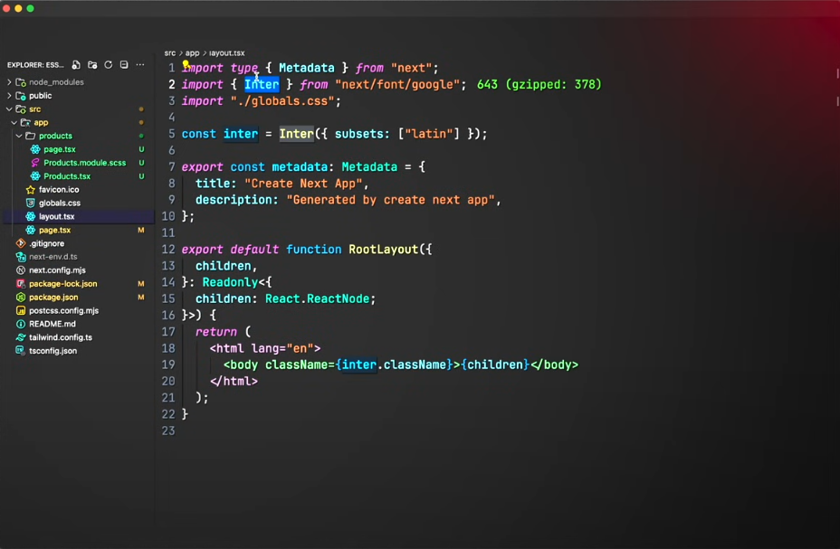
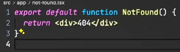
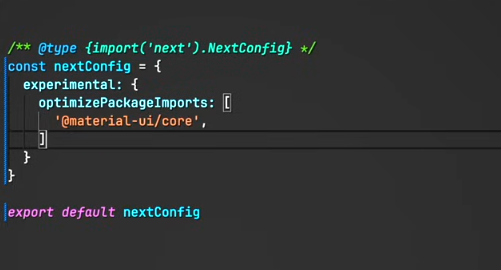


---

# 1. [ Introduction ]

* Next.js is a React framework designed for server-side rendering (SSR) and static site generation (SSG). It offers built-in features such as page-based routing, API routes, and more, making it a powerful tool for building modern web applications.

---

# 2. [ Key Features ]

- **Server-Side Rendering (SSR):** Renders pages on the server for each request, providing dynamic content with improved SEO.
- **Static Site Generation (SSG):** Generates HTML at build time, ideal for static content.
- **API Routes:** Allows you to build backend API endpoints directly within your application.
- **File-Based Routing:** Utilizes the `pages` directory structure to automatically handle routing.
- **Image Optimization:** Automatically optimizes images for faster loading times and better performance.

---

# 3. [ Installation ]

* Install Next.js using npm or yarn:

```bash
npx create-next-app@latest my-next-app
```

* To start the development server:

```bash
cd my-next-app
npm run dev
```

---

# 4. [ Project Structure ]

- `pages/`: Contains your application's pages.
- `public/`: Stores static files such as images and fonts.
- `styles/`: Includes global and modular styles.
- `components/`: Houses reusable React components.
- `api/`: Defines API routes (located within `pages/`).
---

# 5. [ Routing ]

- **Basic Routing:** A file named `about.js` in `pages/` creates the `/about` route.
- **Dynamic Routing:** Use `[id].js` to handle dynamic segments (`/post/1`, `/post/2`).

```typescript
// pages/post/[id].js
import { useRouter } from 'next/router';

const Post = () => {
  const router = useRouter();
  const { id } = router.query;

  return <p>Post: {id}</p>;
};

export default Post;
```

---

# 6. [ Layout ]

* Create a shared layout to maintain consistency across pages.

`Creating a Layout Component:`

```typescript
// components/Layout.js
import React from 'react';

const Layout = ({ children }) => {
  return (
    <div>
      <header>
        <nav>
          <ul>
            <li><a href="/">Home</a></li>
            <li><a href="/about">About</a></li>
            <li><a href="/contact">Contact</a></li>
          </ul>
        </nav>
      </header>
      <main>{children}</main>
      <footer>
        <p>© 2024 My Next.js App</p>
      </footer>
    </div>
  );
};

export default Layout;
```

`Using the Layout Component:`

```typescript
// pages/_app.js
import '../styles/globals.css';
import Layout from '../components/Layout';

function MyApp({ Component, pageProps }) {
  return (
    <Layout>
      <Component {...pageProps} />
    </Layout>
  );
}

export default MyApp;
```

---

# 7. [ Unique Style ]

* Use CSS modules to create unique styles for components.

* Create: `Name.module.css`

```typescript
/* Products.tsx */
import styles from './Products.module.css';

export function Products() {
  return <div className={styles.products}>Products</div>;
}
```

```css
/* Products.module.css */
.products {
  background-color: aqua;
}
```

* Apply unique styles to any component.

---

# 8. [ Fonts ]


To customize fonts:

- Replace `import { Inter }` with your desired font (e.g., `Metal`).
- Update `... = Inter({ subsets: ["latin"] });` to `Metal`, and include the font weight if necessary.

---

# 9. [ Custom 404 Page ]


Create a `404.js` page to handle not-found routes:



---

# 10. [ Images ]

Utilize the `Image` component from `next/image` for optimized images:

```typescript
import Image from 'next/image';

<Image src='/next.svg' alt='Next.js Logo' width={200} height={50} />
```

---

# 11. [ Useful Hooks ]

Here are some essential hooks in Next.js:

### `useRouter`

Access router information and navigate programmatically:

```typescript
import { useRouter } from 'next/router';

const MyComponent = () => {
  const router = useRouter();
  const { query } = router;

  return (
    <div>
      <p>Query parameter: {query.id}</p>
      <button onClick={() => router.push('/new-page')}>Go to New Page</button>
    </div>
  );
};

export default MyComponent;
```

### `useSWR`

For data fetching and caching:

```typescript
import useSWR from 'swr';

const fetcher = (url: string) => fetch(url).then(res => res.json());

const MyComponent = () => {
  const { data, error } = useSWR('/api/data', fetcher);

  if (error) return <div>Failed to load</div>;
  if (!data) return <div>Loading...</div>;

  return <div>Data: {JSON.stringify(data)}</div>;
};

export default MyComponent;
```

### `useEffect`

For managing side effects like data fetching:

```typescript
import { useEffect, useState } from 'react';

const MyComponent = () => {
  const [data, setData] = useState(null);

  useEffect(() => {
    const fetchData = async () => {
      const response = await fetch('/api/data');
      const result = await response.json();
      setData(result);
    };

    fetchData();
  }, []); // Runs once on mount

  return <div>Data: {data ? JSON.stringify(data) : 'Loading...'}</div>;
};

export default MyComponent;
```

### `useState`

For managing local state:

```typescript
import { useState } from 'react';

const Counter = () => {
  const [count, setCount] = useState(0);

  return (
    <div>
      <p>Count: {count}</p>
      <button onClick={() => setCount(count + 1)}>Increment</button>
    </div>
  );
};

export default Counter;
```

### `useContext`

For context management:

```typescript
import { createContext, useContext, useState } from 'react';

const MyContext = createContext(null);

const ProviderComponent = ({ children }) => {
  const [value, setValue] = useState('Hello');

  return (
    <MyContext.Provider value={{ value, setValue }}>
      {children}
    </MyContext.Provider>
  );
};

const ConsumerComponent = () => {
  const { value, setValue } = useContext(MyContext);

  return (
    <div>
      <p>Context value: {value}</p>
      <button onClick={() => setValue('Updated')}>Update Context</button>
    </div>
  );
};

const App = () => (
  <ProviderComponent>
    <ConsumerComponent />
  </ProviderComponent>
);

export default App;
```

---

# 12. [ `client/server rendering` ] 

In Next.js, you can specify whether components should be rendered on the client or server, optimizing performance and functionality.

### `use client`

Marks a component for client-side rendering:

- **Client-Side Rendering:** Renders in the browser.
- **Interactivity:** Supports client-side features like state and effects.

Example: 

```typescript
// components/ClientComponent.js
'use client';

import { useState } from 'react';

const ClientComponent = () => {
  const [count, setCount] = useState(0);

  return (
    <div>
      <h1>Client Rendered Content</h1>
      <p>Count: {count}</p>
      <button onClick={() => setCount(count + 1)}>Increment</button>
    </div>
  );
};

export default ClientComponent;
```

### `use server`

Indicates server-side rendering (default behavior unless `use client` is used):

- **Server-Side Rendering:** Renders on the server.
- **No Client-Side JavaScript:** Reduces client-side JavaScript and bundle size.

Example:

```typescript
// components/ServerComponent.js

const ServerComponent = ({ data }) => {
  return (
    <div>
      <h1>Server Rendered Content</h1>
      <p>Data: {data}</p>
    </div>
  );
};

export async function getServerSideProps() {
  const res = await fetch('https://api.example.com/data');
  const data = await res.json();

  return { props: { data } };
}

export default ServerComponent;
```

---

# 13. [ SSR, ISR, SSG ]

Next.js offers various rendering methods suitable for different scenarios: 
* Server-Side Rendering (SSR). 
* Incremental Static Regeneration (ISR).
* Static Site Generation (SSG).

### `SSR`

Generates HTML on the server for each request, ideal for dynamic content.

How It Works:

- **On Each Request:** HTML is generated per request.
- **Use Case:** For dynamic or user-specific pages.

 Example

```typescript
//

 pages/ssr-page.js
export async function getServerSideProps() {
  const res = await fetch('https://api.example.com/data');
  const data = await res.json();

  return { props: { data } };
}

const SSRPage = ({ data }) => {
  return <div>Data: {JSON.stringify(data)}</div>;
};

export default SSRPage;
```

### `ISR`

Regenerates static pages at runtime, enabling updates without rebuilding the entire site.

 How It Works

- **On Request:** The page is statically generated at runtime, and subsequent requests use the updated version.
- **Use Case:** For frequently updated static pages.

 Example

```typescript
// pages/isr-page.js
export async function getStaticProps() {
  const res = await fetch('https://api.example.com/data');
  const data = await res.json();

  return {
    props: { data },
    revalidate: 10, // Revalidate at most every 10 seconds
  };
}

const ISRPage = ({ data }) => {
  return <div>Data: {JSON.stringify(data)}</div>;
};

export default ISRPage;
```

### `SSG`

Generates HTML at build time for static content, which can be served efficiently.

How It Works

- **At Build Time:** HTML is generated once during the build.
- **Use Case:** For pages that don't change frequently.

Example

```typescript
// pages/ssg-page.js
export async function getStaticProps() {
  const res = await fetch('https://api.example.com/data');
  const data = await res.json();

  return { props: { data } };
}

const SSGPage = ({ data }) => {
  return <div>Data: {JSON.stringify(data)}</div>;
};

export default SSGPage;
```
---
# 14. [ Correct Project Structure ]

---

# 15. [ Package Optimization ]



Certainly! Here’s a topic for MDX installation and usage, formatted for Markdown:

---

# 16.[ Deployment ]

Deploy your Next.js application to Vercel, Netlify, or any other hosting provider that supports Next.js.

### Vercel Deployment

1. **Sign Up / Log In:** Create an account on Vercel.
2. **Connect Repository:** Link your GitHub/GitLab/Bitbucket repository.
3. **Deploy:** Follow the instructions to deploy your application.

### Netlify Deployment

1. **Sign Up / Log In:** Create an account on Netlify.
2. **Create a New Site:** Import your project from GitHub/GitLab/Bitbucket.
3. **Deploy:** Follow the instructions to deploy your application.
---

# 17.[ Project building ]

Build your project with these commands.

```tsx
npm run build // builds project

npm run start // starts builded project
```
---
# 18.[ Middleware ]

Function that mostly used in authorization.
* Give permissions to any page
* Block permission to any page

For ex: Admin page only available for admin, if user is not admin user stays in user page.

```tsx
import type {NextRequest} from 'next/server'
import {NextResponse} from 'next/server'

export function middleware(request: NextRequest) {

const isAbout = request.url.includes('about')

if(isAbout){
 if(true) return NextResponse.next()
  else return NextResponse.redirect(new URL('/home',request.url))
}

return NextResponse.redirect(new URL('/home', request.url))
}

export const config = {
matcher: ['/about/:path*, '/dashboard/:path*'],
}
```

```tsx
cookies().get('token') // Dev can get server side cookie
headers().             // Dev can edit headers - delete,get,set etc..
```
---
# 19.[ NextConfig ]

Add some configurations to your nextjs project.

```tsx
	const nextConfig = {
	i18n? 			  // localization, must for translating web to different language.
	poweredByHeader? // hackers cant see in what languages you writted project. 
	rewrites?        // so if u have domain for ex: api.domain.com u can rewrite to domain.com/API.
	images?          // if you using images from outside resourses.
	webpack?         // you can configure webpack here.
	};
```
---

# 20.[ SEO Optimization ]

Add some configurations to your nextjs project.

```tsx
	export const metadata: Metadata = {
	title: 'Products' // title name, must have.
	applicationName?  // app name, very usefull, must have for PWA.
	description?      // description, must have.
	formatDetection?  // Can make +3706854849 detect as a numbers not phone number.
	icons?            // favicon, other icons can be used.
	manifest?         // musthave for PWA.
	openGraph?        // useful for finding your web later.
	robots?           // if you wanna make your web not available to find by SEO.
	verification?     // your can verificate here data by givin key.
}
```


---
