# --------- REACT ------------
---

# [ Vite vs Webpack ]

When developing React projects, `Vite` and `Webpack` are commonly used tools for project setup and bundling.

- **Vite:** The newest and fastest option, gaining popularity for creating modern `React` projects.
- **Webpack:** A more established tool, widely used in enterprise-level projects. It’s beneficial to learn, though you can start with Vite.

---

# 1. [ Introduction ]

- **React.js** is a TypeScript-friendly JavaScript library for building user interfaces.
- Code is divided into **components**, making it modular and reusable.
- React efficiently **manages states**, enabling **real-time updates** to the UI.

---

# 2. [ Installation ]

1. Install `react` with Vite:

    ```bash
    npm create vite@latest
    ```

2. Start the development server:

    ```bash
    cd your-app
    npm i
    npm run dev
    ```

---

# 3. [ Card Components ]

* Create a simple `card` component:
```jsx
function Card({ title, content }) {
  return (
    <div className="card">
      <h2>{title}</h2>
      <p>{content}</p>
    </div>
  );
}

function App() {
  return <Card title="My Card" content="This is a card component." />;
}
```

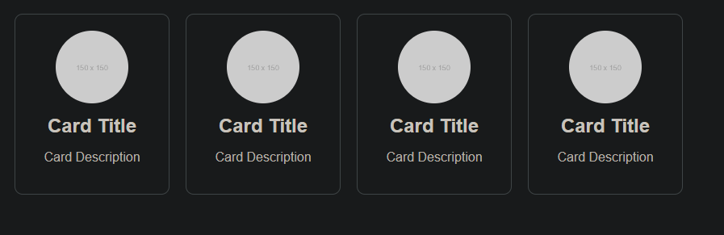
---

# 4. [ Adding CSS Styles ]

* Add styles using external `CSS`:
```css
/* styles.css */
.card {
  border: 1px solid #ccc;
  padding: 20px;
  border-radius: 8px;
  background-color: #f9f9f9;
}
```
* Import and use the `CSS` in your component:
```jsx
import './styles.css';

function Card() {
  return <div className="card">Styled Card</div>;
}
```
---

# 5. [ Props ]

* `Props` allow passing data to components:
```jsx
function Greeting({ name }) {
  return <h1>Hello, {name}!</h1>;
}

function App() {
  return <Greeting name="John" />;
}
```
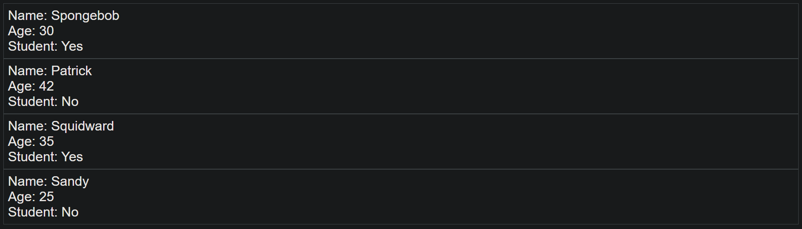
---

# 6. [ Conditional Rendering ]
* Render different content based on `conditions`:
```jsx 
function UserGreeting({ isLoggedIn }) {
  return isLoggedIn ? <h1>Welcome back!</h1> : <h1>Please log in</h1>;
}
```
---

# 7. [ Rendering Lists ]
* `Render` a list of items using `map`:
```jsx 
const items = ['Apple', 'Banana', 'Cherry'];

function ItemList() {
  return (
    <ul>
      {items.map((item, index) => (
        <li key={index}>{item}</li>
      ))}
    </ul>
  );
}

```
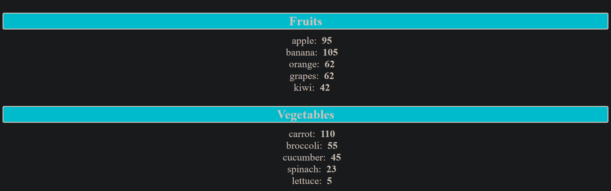
---

# 8. [ Click Events ]
* `Handle` button clicks:
```jsx 
function Button() {
  function handleClick() {
    alert('Button clicked!');
  }

  return <button onClick={handleClick}>Click Me</button>;
}
```
---

# 9. [ useState Hook ]
* `Manage` component state with `useState`:
```jsx 
import { useState } from 'react';

function Counter() {
  const [count, setCount] = useState(0);

  return (
    <div>
      <p>Count: {count}</p>
      <button onClick={() => setCount(count + 1)}>Increment</button>
    </div>
  );
}
```
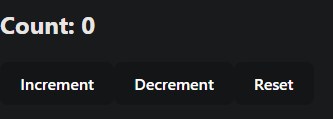

---

# 10. [ onChange Event Handler ]
* `Handle` input changes:
```jsx
function InputField() {
  const [text, setText] = useState('');

  function handleChange(event) {
    setText(event.target.value);
  }

  return (
    <div>
      <input type="text" value={text} onChange={handleChange} />
      <p>You typed: {text}</p>
    </div>
  );
}
```
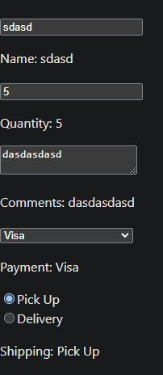
---

# 11. [ Color Picker App ]
* A simple app to pick a `color`:
```jsx 
function ColorPicker() {
  const [color, setColor] = useState('#000000');

  return (
    <div>
      <input
        type="color"
        value={color}
        onChange={(e) => setColor(e.target.value)}
      />
      <p>Selected color: {color}</p>
    </div>
  );
}
```
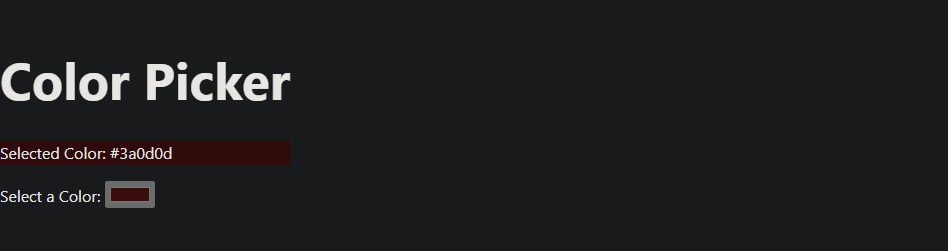
---

# 12. [ Updater Functions ]
* Use the `functional form` of state setters for better accuracy:
```jsx 
function Counter() {
  const [count, setCount] = useState(0);

  return (
    <div>
      <button onClick={() => setCount((prevCount) => prevCount + 1)}>
        Increment
      </button>
      <p>{count}</p>
    </div>
  );
}
```
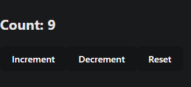
---

# 13. [ Updating Objects in State ]
* `Update` parts of an object in state:
```jsx 
function Profile() {
  const [user, setUser] = useState({ name: 'John', age: 25 });

  function updateAge() {
    setUser((prevUser) => ({ ...prevUser, age: prevUser.age + 1 }));
  }

  return (
    <div>
      <p>{user.name} is {user.age} years old</p>
      <button onClick={updateAge}>Increase Age</button>
    </div>
  );
}
```
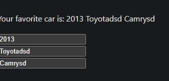
---

# 14. [ Updating Arrays in State ]
* `Add` an item to an array in state:

```jsx 
function ItemList() {
  const [items, setItems] = useState(['Apple', 'Banana']);

  function addItem() {
    setItems((prevItems) => [...prevItems, 'Cherry']);
  }

  return (
    <div>
      <ul>
        {items.map((item, index) => <li key={index}>{item}</li>)}
      </ul>
      <button onClick={addItem}>Add Cherry</button>
    </div>
  );
}
```
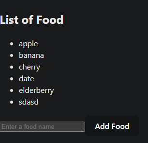
---

# 15. [ Updating Array of Objects in State ]
* `Modify` an object in an array in state:

```jsx 
function UserList() {
  const [users, setUsers] = useState([
    { id: 1, name: 'John' },
    { id: 2, name: 'Jane' },
  ]);

  function updateUserName(id, newName) {
    setUsers((prevUsers) =>
      prevUsers.map((user) =>
        user.id === id ? { ...user, name: newName } : user
      )
    );
  }

  return (
    <div>
      <ul>
        {users.map((user) => (
          <li key={user.id}>{user.name}</li>
        ))}
      </ul>
      <button onClick={() => updateUserName(1, 'Johnny')}>Update Name</button>
    </div>
  );
}
```
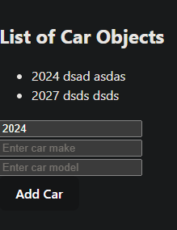
---

# 16. [ To-Do List App ]
* A basic `to-do list app`:
```jsx 
function TodoList() {
  const [tasks, setTasks] = useState([]);
  const [newTask, setNewTask] = useState('');

  function addTask() {
    setTasks([...tasks, newTask]);
    setNewTask('');
  }

  return (
    <div>
      <input
        type="text"
        value={newTask}
        onChange={(e) => setNewTask(e.target.value)}
      />
      <button onClick={addTask}>Add Task</button>
      <ul>
        {tasks.map((task, index) => (
          <li key={index}>{task}</li>
        ))}
      </ul>
    </div>
  );
}
```
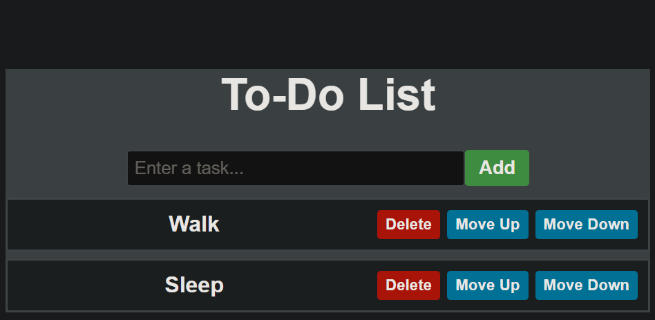
---

# 17. [ useEffect Hook ]
* Run `side effects` in response to state or props changes:
```jsx 
import { useEffect, useState } from 'react';

function Timer() {
  const [seconds, setSeconds] = useState(0);

  useEffect(() => {
    const interval = setInterval(() => {
      setSeconds((prevSeconds) => prevSeconds + 1);
    }, 1000);

    return () => clearInterval(interval); // Cleanup
  }, []);

  return <p>Time elapsed: {seconds}s</p>;
}
```
---

# 18. [ Digital Clock App ]
* A simple digital clock using `useEffect`:
```jsx
function Clock() {
  const [time, setTime] = useState(new Date().toLocaleTimeString());

  useEffect(() => {
    const interval = setInterval(() => {
      setTime(new Date().toLocaleTimeString());
    }, 1000);

    return () => clearInterval(interval);
  }, []);

  return <p>The time is: {time}</p>;
}
```

---

# 19. [ useContext Hook ]
* Share state across components `without` prop drilling:
```jsx
import { createContext, useContext, useState } from 'react';

const UserContext = createContext();

function UserProvider({ children }) {
  const [user, setUser] = useState({ name: 'John', age: 25 });
  return (
    <UserContext.Provider value={user}>{children}</UserContext.Provider>
  );
}

function UserProfile() {
  const user = useContext(UserContext);
  return <p>{user.name} is {user.age} years old</p>;
}

function App() {
  return (
    <UserProvider>
      <UserProfile />
    </

```
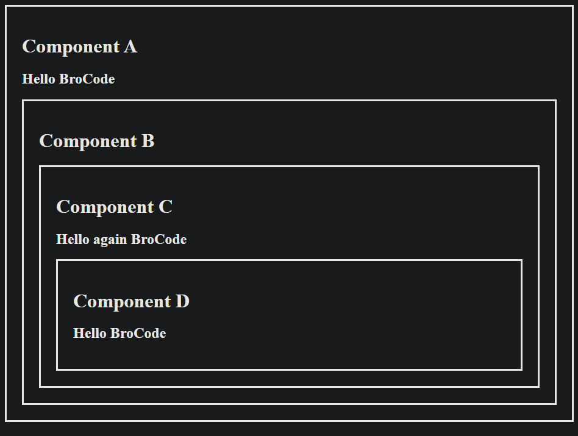
---

# 20. [ useRef Hook ]
* `useRef` allows you to create a reference to a `DOM` element or persist values between renders without causing the component to `re-render` when the reference is updated.

```jsx
import { useRef } from 'react';

const FocusInput = () => {
  const inputRef = useRef(null);

  const handleClick = () => {
    // Access the input element and focus it
    inputRef.current.focus();
  };

  return (
    <div>
      <input ref={inputRef} type="text" placeholder="Click the button to focus" />
      <button onClick={handleClick}>Focus Input</button>
    </div>
  );
};

export default FocusInput;

```
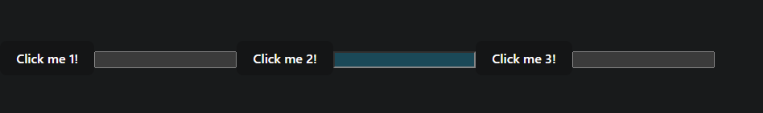
---

# 21. [ Stopwatch App ]
* A simple stopwatch that starts, stops, and resets using `useState` and `useEffect`.

```jsx 
import { useState, useEffect } from 'react';

const Stopwatch = () => {
  const [time, setTime] = useState(0);
  const [isRunning, setIsRunning] = useState(false);

  useEffect(() => {
    let interval;
    if (isRunning) {
      interval = setInterval(() => setTime((prevTime) => prevTime + 1), 1000);
    }
    return () => clearInterval(interval); // Cleanup
  }, [isRunning]);

  return (
    <div>
      <h1>{time}s</h1>
      <button onClick={() => setIsRunning(!isRunning)}>
        {isRunning ? 'Stop' : 'Start'}
      </button>
      <button onClick={() => setTime(0)}>Reset</button>
    </div>
  );
};

export default Stopwatch;
```
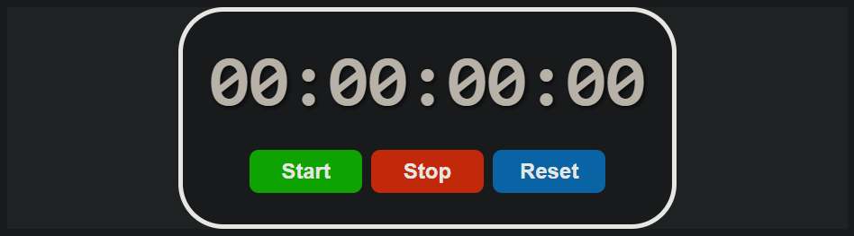
---

# 22. [ onSubmit Event Handler ]
* Handling form submissions with the `onSubmit` event to prevent page reloads and handle input data.

```jsx 
import { useState } from 'react';

const SubmitForm = () => {
  const [input, setInput] = useState('');

  const handleSubmit = (e) => {
    e.preventDefault();
    alert(`Form submitted: ${input}`);
    setInput('');
  };

  return (
    <form onSubmit={handleSubmit}>
      <input
        type="text"
        value={input}
        onChange={(e) => setInput(e.target.value)}
      />
      <button type="submit">Submit</button>
    </form>
  );
};

export default SubmitForm;
```
---

# 23. [ Car Catalog ]
* Rendering a catalog of cars using `props` and `state`.

```jsx 
const CarCard = ({ brand, model, year }) => (
  <div className="car-card">
    <h2>{brand}</h2>
    <p>{model}</p>
    <p>{year}</p>
  </div>
);

const CarCatalog = () => {
  const cars = [
    { brand: 'Tesla', model: 'Model S', year: 2020 },
    { brand: 'BMW', model: 'X5', year: 2019 },
    { brand: 'Audi', model: 'Q7', year: 2018 },
  ];

  return (
    <div>
      {cars.map((car, index) => (
        <CarCard key={index} {...car} />
      ))}
    </div>
  );
};

export default CarCatalog;
```
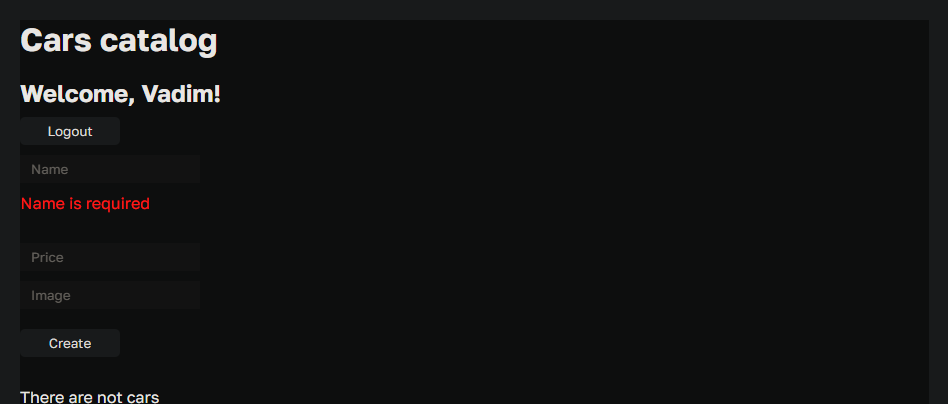
---

# 24. [ Fetch vs Axios ]
`Fetch` API and Axios are two popular tools to make `HTTP` requests in React.
* Fetch: Native JavaScript API.
* Axios: Third-party library with a simpler syntax and extra features like interceptors.

`Fetch Example:`

```jsx
useEffect(() => {
  fetch('https://jsonplaceholder.typicode.com/posts')
    .then((response) => response.json())
    .then((data) => console.log(data))
    .catch((error) => console.error(error));
}, []);
```

`Axios Example:`
```jsx 
import axios from 'axios';

useEffect(() => {
  axios.get('https://jsonplaceholder.typicode.com/posts')
    .then((response) => console.log(response.data))
    .catch((error) => console.error(error));
}, []);
```
---

# 25. [ JSON Server ]
`JSON` Server provides a full `fake` REST API with minimal setup for prototyping and testing.
* Setup JSON Server:

1. Install JSON Server globally:
```bash
npm install -g json-server
```
2. Create a db.json file with data:
```json
{
  "cars": [
    { "id": 1, "brand": "Tesla", "model": "Model S" }
  ]
}
```
3. Run the server:
```bash 
json-server --watch db.json --port 5000
```

* Fetch Data from JSON Server:
```jsx 
useEffect(() => {
  fetch('http://localhost:5000/cars')
    .then((response) => response.json())
    .then((data) => console.log(data));
}, []);
```
---

# 26. [ React Router DOM ]
React Router enables `navigation` between different components in a React app.
* `Installation:`
```bash
npm install react-router-dom
```
* `Example:`
```jsx 
// React Router DOM is a library for handling routing in React applications. 
// It provides components like BrowserRouter, Route, Link, and Switch for defining routes 
// and rendering different components based on the current URL. React Router DOM enables 
// client-side routing, allowing users to navigate between different views within a single-page 
// application without full-page reloads.


// npm install react-router-dom

import React from 'react';
import ReactDOM from 'react-dom';
import { Link, Redirect, Route, BrowserRouter as Router, Switch, useHistory, useLocation } from 'react-router-dom';

// Components
const Home = () => <h2>Home</h2>;
const About = () => <h2>About</h2>;
const Contact = () => <h2>Contact</h2>;
const UserDetails = ({ match }) => <div>User ID: {match.params.userId}</div>;
const NotFound = () => <h2>404 Not Found</h2>;

// Navbar Component
const Navbar = () => {
  return (
    <nav>
      <ul>
        <li><Link to="/">Home</Link></li>
        <li><Link to="/about">About</Link></li>
        <li><Link to="/contact">Contact</Link></li>
      </ul>
    </nav>
  );
};

// Programmatic Navigation Component
const MyComponent = () => {
  const history = useHistory();

  const handleClick = () => {
    history.push('/new-page');
  };

  return <button onClick={handleClick}>Go to New Page</button>;
};

// Query Params Component
const QueryComponent = () => {
  const location = useLocation();
  const queryParams = new URLSearchParams(location.search);

  return <div>Query Param: {queryParams.get('paramName')}</div>;
};

// App Component
const App = () => {
  return (
    <Router>
      <div>
        <Navbar />
        <Switch>
          <Route exact path="/" component={Home} />
          <Route path="/about" component={About} />
          <Route path="/contact" component={Contact} />
          <Route path="/users/:userId" component={UserDetails} />
          <Route path="/query" component={QueryComponent} />
          <Route path="/old-page">
            <Redirect to="/new-page" />
          </Route>
          <Route component={NotFound} />
        </Switch>
      </div>
    </Router>
  );
};

ReactDOM.render(<App />, document.getElementById('root'));
```
---

# 27. [ React Hook Form ]
React Hook Form `simplifies` form handling and validation.
* `Installation:`
```bash
npm install react-hook-form
```
* `Example:`
```jsx 
// React Hook Form is a lightweight library for building forms in React. 
// It emphasizes simplicity, performance, and developer experience. 
// With React Hook Form, you can easily manage form state, validate input, and handle 
// form submissions using React hooks. It provides a simple API and seamless integration 
// with React components.

// npm install react-hook-form

import React from 'react';
import ReactDOM from 'react-dom';
import { useForm } from 'react-hook-form';

// App Component
const App = () => {
  const { register, handleSubmit, formState: { errors } } = useForm();

  const onSubmit = (data) => {
    console.log(data);
  };

  return (
    <div>
      <h1>React Hook Form Example</h1>
      <form onSubmit={handleSubmit(onSubmit)}>
        <label htmlFor="name">Name:</label>
        <input type="text" id="name" {...register("name", { required: true })} />
        {errors.name && <span>This field is required</span>}
        
        <label htmlFor="email">Email:</label>
        <input type="email" id="email" {...register("email", { required: true, pattern: /^\S+@\S+$/i })} />
        {errors.email && <span>Please enter a valid email</span>}
        
        <button type="submit">Submit</button>
      </form>
    </div>
  );
};

ReactDOM.render(<App />, document.getElementById('root'));
```
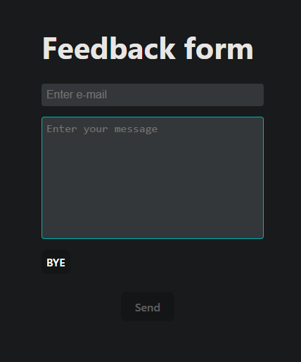
---

# 28. [ TanStack/React Query ]
React Query `simplifies` fetching, caching, and synchronizing server data.

* `Installation:`
```bash
npm install @tanstack/react-query
```
* `Example:`
```jsx 
// The @tanstack/react-query library is an implementation of React Query, 
// a popular library for managing server state and caching in React applications. 
// It provides hooks like useQuery and useMutation to fetch and manipulate data from APIs, 
// along with features like caching, automatic retries, and data synchronization.

// npm i @tanstack/react-query

import React from 'react';
import ReactDOM from 'react-dom';
import { QueryClient, QueryClientProvider, useQuery } from 'react-query';
import { ReactQueryDevtools } from 'react-query/devtools';

// Create a new query client instance
const queryClient = new QueryClient();

// Fetch function for data retrieval
const fetchData = async () => {
  const response = await fetch('https://api.example.com/data');
  if (!response.ok) {
    throw new Error('Network response was not ok');
  }
  return response.json();
};

// App Component
const App = () => {
  const { data, isLoading, isError } = useQuery('data', fetchData);

  if (isLoading) return <div>Loading...</div>;
  if (isError) return <div>Error fetching data</div>;

  return (
    <div>
      <h1>React Query Example</h1>
      <p>{JSON.stringify(data)}</p>
    </div>
  );
};

// Render the App component within the QueryClientProvider
ReactDOM.render(
  <QueryClientProvider client={queryClient}>
    <App />
    <ReactQueryDevtools /> {/* Optional: Devtools for React Query */}
  </QueryClientProvider>,
  document.getElementById('root')
);

```
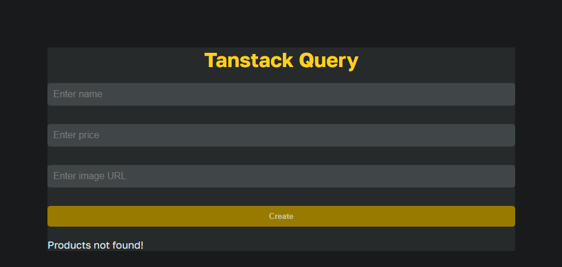
---

# 29. [ useMutation Hook ]
`useMutation` is used to perform POST, PUT, DELETE requests in React Query.

```jsx 
// The useMutation hook is a React Query hook used for managing mutation operations,
// such as creating, updating, or deleting data. It simplifies handling asynchronous operations, 
// provides state management for loading and error handling, and offers callbacks for success 
// and error cases.

import { useMutation } from '@tanstack/react-query';

const { mutate, isLoading, isError, error, data, reset } = useMutation({
  mutationKey: 'unique-key',
  mutationFn: async (data) => {
    // Perform async operation (e.g., API request)
    return await asyncOperation(data);
  },
  onSuccess: (data) => {
    // Handle successful mutation
  },
  onError: (error) => {
    // Handle error
  },
});

```
---

# 30. [ CMD Shortcuts ]
Commonly used Command Line `(CMD)` shortcuts for React development:
* `Start React App:`
```bash 
npm start
```
* `Build React App:`
```bash 
npm run build
```
* `Install Dependency:`
```bash 
npm i package-name
```
* `Create react-vite project:`
```bash
npm create vite@latest my-react-app 	
```
* `Change terminal path:`
```bash 
cd my-react-app
```
* `Starts react server:`
```bash 
npm run dev
```
* `Install React Router:`
```bash 
npm i react-router-dom@latest
```

* `Install React Hook Form:`
```bash 
npm i react-hook-form@latest
``` 

* `Install React Query:`
```bash 
npm i @tanstack/react-query@latest
```

* `Install json-server:`
```bash
 npm install json-server
```

* `Starts json-server:`
```bash 
npx json-server db.json --port 4200
```

* `Install Axios:`
```bash 
npm install axios
```

* `Creates functional component instantly:`
```txt 
rafce
```
---
Here’s the updated section with your content integrated for **TanStack Query** (React Query):

---

# 31. [ TanStack Query More..]

**ReactQuery** - It's a library for managing server responses in React applications, making data fetching, caching, and synchronization easier.

### Installation..

1. Install the ReactQuery library using npm:
   ```bash
   npm i @tanstack/react-query
   ```

   *Optional:* Install ReactQuery Devtools for debugging:
   ```bash
   npm i @tanstack/react-query-devtools
   ```

2. Import the necessary hooks and functions in your components:
   ```jsx
   import {
     useQuery,
     useMutation,
     useQueryClient,
     QueryClient,
     QueryClientProvider,
   } from '@tanstack/react-query';

   // Optional: Import ReactQuery Devtools for debugging
   import { ReactQueryDevtools } from '@tanstack/react-query-devtools';
   ```

3. Create a Query Client:
   ```jsx
   const queryClient = new QueryClient();
   ```

4. Wrap your application with `QueryClientProvider` and pass the `queryClient` as a prop:
   ```jsx
   function App() {
     return (
       <QueryClientProvider client={queryClient}>
         <MyApp />
         {/* Optional: Add Devtools for debugging */}
         <ReactQueryDevtools initialIsOpen={false} />
       </QueryClientProvider>
     );
   }
   ```

5. Access the `queryClient` object in your components when needed:
   ```jsx
   const queryClient = useQueryClient();
   ```

---

### Common Properties & Functions..

1. **What is the purpose of the `useQuery` hook?**
   - **Answer:** It fetches data from the server and manages the response in React applications.

2. **What is the purpose of the `useMutation` hook?**
   - **Answer:** It is used to send data (e.g., POST, PUT, DELETE) to the server and manage the response in React applications.

3. **What is the purpose of the `queryClient` object?**
   - **Answer:** It manages the cache of server responses in React applications.

4. **What is the purpose of the `queryKey` property?**
   - **Answer:** It uniquely identifies a query in the cache.

5. **What is the purpose of the `queryFn` property?**
   - **Answer:** It defines the function that fetches data from the server.

6. **What is the purpose of the `mutationFn` property?**
   - **Answer:** It defines the function that sends data to the server.

7. **What is the purpose of the `onSuccess` property?**
   - **Answer:** It defines the function to call when the query or mutation succeeds.

8. **What is the purpose of the `onError` property?**
   - **Answer:** It defines the function to call when the query or mutation fails.

9. **What is the purpose of the `onSettled` property?**
   - **Answer:** It defines the function to call when the query or mutation is settled (either success or error).

10. **What is the purpose of the `invalidateQueries` function?**
    - **Answer:** It invalidates the cached queries, forcing them to refetch.

11. **What is the purpose of the `refetchQueries` function?**
    - **Answer:** It triggers a refetch of specified queries.

12. **What is the purpose of the `isFetching` property?**
    - **Answer:** It checks if the query is currently fetching data from the server.

13. **What is the purpose of the `isLoading` property?**
    - **Answer:** It checks if the query is loading data (either from cache or the server).

14. **What is the purpose of the `isError` property?**
    - **Answer:** It checks if the query encountered an error.

15. **What is the purpose of the `isSuccess` property?**
    - **Answer:** It checks if the query was successfully fetched.

16. **What is the purpose of the `isStale` property?**
    - **Answer:** It checks if the query data is stale and requires refetching.

17. **What is the purpose of the `isFetched` property?**
    - **Answer:** It checks if the query has been fetched at least once.
---
